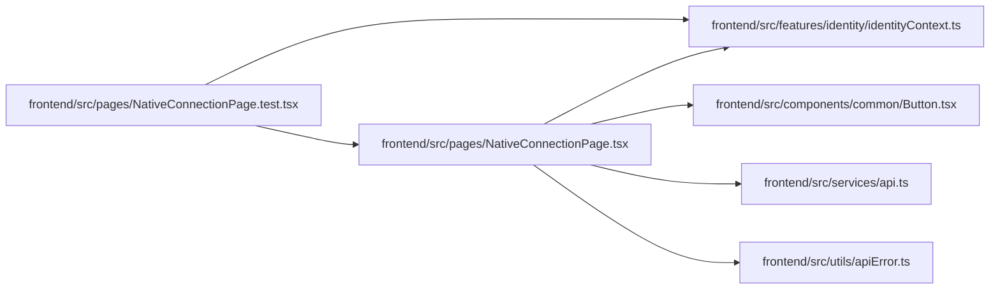

# NativeConnectionPage Module

**Path:** `frontend/src/pages/NativeConnectionPage.tsx`

## Description

Provides explicit browser consent for the Android companion. It shows the signed-in account and verification code, requires a matching-code checkbox, and resets consent when the request or principal changes. Loading, failure, retry, and approval are separate visible states.

## Imports

| Source | Symbols |
|--------|---------|
| `../components/common/Button` | `Button` |
| `../features/identity/identityContext` | `useIdentity` |
| `../services/api` | `api` |
| `../utils/apiError` | `getApiErrorMessage` |
| `@tanstack/react-query` | `useQuery` |
| `react` | `useState` |
| `react-i18next` | `useTranslation` |
| `react-router-dom` | `useSearchParams` |

## Module Signals

| Signal | Values |
|--------|--------|
| Exports | `default` |

## Local dependency map

<!-- Auto-generated local dependency summary. Do not edit by hand. -->

### Internal neighbors

| Direction | Module |
|---|---|
| Inbound | [NativeConnectionPage.test](../modules/NativeConnectionPage.test.md) |
| Outbound | [Button](../modules/Button.md) |
| Outbound | [identityContext](../modules/identityContext.md) |
| Outbound | [api](../modules/api.md) |
| Outbound | [apiError](../modules/apiError.md) |

### External packages

| Language | Used packages | Undeclared packages |
|---|---:|---:|
| typescript | 4 | 0 |

## Functions

| Function | Signature | Decorators | Description |
|----------|-----------|------------|-------------|
| `NativeConnectionPage` | `()` | — | — |