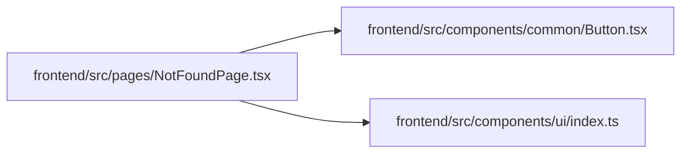

# NotFoundPage Module

**Path:** `frontend/src/pages/NotFoundPage.tsx`

## Description

_Auto-generated from `frontend/src/pages/NotFoundPage.tsx`._

## Imports

| Source | Symbols |
|--------|---------|
| `../components/common/Button` | `Button` |
| `../components/ui` | `PageHeader`, `SectionCard` |
| `lucide-react` | `Home` |
| `react-i18next` | `useTranslation` |
| `react-router-dom` | `useLocation`, `useNavigate` |

## Module Signals

| Signal | Values |
|--------|--------|
| Exports | `default` |

## Local dependency map

<!-- Auto-generated local dependency summary. Do not edit by hand. -->

### Internal neighbors

| Direction | Module |
|---|---|
| Outbound | [Button](../modules/Button.md) |
| Outbound | [index](../modules/index.md) |

### External packages

| Language | Used packages | Undeclared packages |
|---|---:|---:|
| typescript | 3 | 0 |
