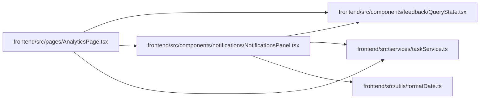

# NotificationsPanel Module

**Path:** `frontend/src/components/notifications/NotificationsPanel.tsx`

## Description

_Auto-generated from `frontend/src/components/notifications/NotificationsPanel.tsx`._

## Imports

| Source | Symbols |
|--------|---------|
| `../../services/taskService` | `taskService` |
| `../../utils/formatDate` | `formatDate`, `formatDateTime` |
| `../feedback/QueryState` | `QueryErrorState` |
| `@tanstack/react-query` | `useQuery` |
| `clsx` | `clsx` |
| `lucide-react` | `AlertCircle`, `History`, `CheckCircle` |
| `react` | `React`, `useState` |
| `react-i18next` | `useTranslation` |

## Module Signals

| Signal | Values |
|--------|--------|
| Exports | `NotificationsPanel` |

## Local dependency map

<!-- Auto-generated local dependency summary. Do not edit by hand. -->

### Internal neighbors

| Direction | Module |
|---|---|
| Inbound | [AnalyticsPage](../modules/AnalyticsPage.md) |
| Outbound | [QueryState](../modules/QueryState.md) |
| Outbound | [taskService](../modules/taskService.md) |
| Outbound | [formatDate](../modules/formatDate.md) |

### External packages

| Language | Used packages | Undeclared packages |
|---|---:|---:|
| typescript | 5 | 0 |

## Classes

| Class | Kind | Line | Bases / Target | Description |
|-------|------|------|----------------|-------------|
| [NotificationsPanelProps](../entities/NotificationsPanelProps.md) | Class | 10 | — | — |
| [Tab](../entities/Tab.md) | Type alias | 15 | — | — |

## Functions

| Function | Signature | Decorators | Description |
|----------|-----------|------------|-------------|
| `NotificationsPanel` | `({ iterationId, className })` | — | — |
