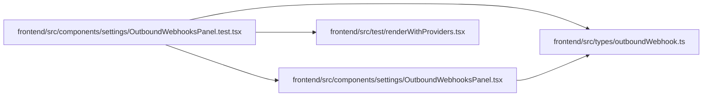

# OutboundWebhooksPanel.test Module

**Path:** `frontend/src/components/settings/OutboundWebhooksPanel.test.tsx`

## Description

_Auto-generated from `frontend/src/components/settings/OutboundWebhooksPanel.test.tsx`._

## Imports

| Source | Symbols | Type-only | Runtime emission |
|--------|---------|-----------|------------------|
| `../../test/renderWithProviders` | `renderWithProviders` | — | compiler-dependent |
| `../../types/outboundWebhook` | `OutboundWebhookDelivery`, `OutboundWebhookTarget` | Declaration | erased |
| `./OutboundWebhooksPanel` | `OutboundWebhooksPanel` | — | compiler-dependent |
| `@testing-library/react` | `act`, `screen`, `waitFor`, `within` | — | compiler-dependent |
| `vitest` | `beforeEach`, `describe`, `expect`, `it`, `vi` | — | compiler-dependent |

## Module Signals

| Signal | Values |
|--------|--------|
| Constants | `adminAccessMock`, `outboundWebhookServiceMock` |
| Module calls | `adminAccessMock = hoisted`, `outboundWebhookServiceMock = hoisted`, `mock`, `mock`, `describe` |

## Local dependency map

<!-- Auto-generated local dependency summary. Do not edit by hand. -->
This graph shows full source coupling. Type dependencies can be erased; compiler-dependent cycle groups are runtime candidates, not confirmed initialization cycles.

```mermaid
flowchart LR
    n0["frontend/src/components/settings/OutboundWebhooksPanel.test.tsx"]
    n1["frontend/src/components/settings/OutboundWebhooksPanel.tsx"]
    n2["frontend/src/test/renderWithProviders.tsx"]
    n3["frontend/src/types/outboundWebhook.ts"]
    n0 --> n1
    n0 --> n2
    n0 --> n3
    n1 --> n3
    click n0 "../modules/OutboundWebhooksPanel.test.md"
    click n1 "../modules/OutboundWebhooksPanel.md"
    click n2 "../modules/renderWithProviders.md"
    click n3 "../modules/outboundWebhook.md"
```

### Internal neighbors

| Direction | Module |
|---|---|
| Outbound | [OutboundWebhooksPanel](../modules/OutboundWebhooksPanel.md) |
| Outbound | [renderWithProviders](../modules/renderWithProviders.md) |
| Outbound | [outboundWebhook](../modules/outboundWebhook.md) |

### External packages

| Language | Used packages | Undeclared packages |
|---|---:|---:|
| typescript | 2 | 0 |
