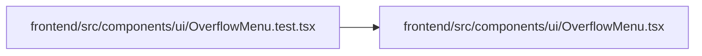

# OverflowMenu Module

**Path:** `frontend/src/components/ui/OverflowMenu.tsx`

## Description

_Auto-generated from `frontend/src/components/ui/OverflowMenu.tsx`._

## Imports

| Source | Symbols |
|--------|---------|
| `clsx` | `clsx` |
| `lucide-react` | `MoreHorizontal` |
| `react` | `useEffect`, `useId`, `useRef`, `useState`, `KeyboardEvent`, `ReactNode` |
| `react-i18next` | `useTranslation` |

## Module Signals

| Signal | Values |
|--------|--------|
| Exports | `OverflowMenu`, `OverflowMenuItem` |

## Local dependency map

<!-- Auto-generated local dependency summary. Do not edit by hand. -->

### Internal neighbors

| Direction | Module |
|---|---|
| Inbound | [OverflowMenu.test](../modules/OverflowMenu.test.md) |

### External packages

| Language | Used packages | Undeclared packages |
|---|---:|---:|
| typescript | 4 | 0 |

## Classes

| Class | Kind | Line | Bases / Target | Description |
|-------|------|------|----------------|-------------|
| [OverflowMenuItem](../entities/OverflowMenuItem.md) | Type alias | 7 | — | — |

## Functions

| Function | Signature | Decorators | Description |
|----------|-----------|------------|-------------|
| `OverflowMenu` | `({     items,     label,     className, }: {     items: OverflowMenuItem[];     label?: string;     className?: string; })` | — | — |
