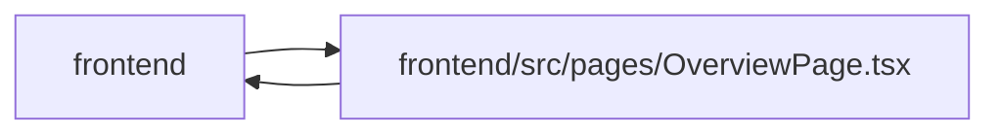

# OverviewPage Module

**Path:** `frontend/src/pages/OverviewPage.tsx`

## Description

_Auto-generated from `frontend/src/pages/OverviewPage.tsx`._

## Imports

| Source | Symbols |
|--------|---------|
| `../components/common/Button` | `Button` |
| `../components/feedback/QueryState` | `QueryErrorState`, `QueryLoadingState` |
| `../components/tasks/WorkMetricsLine` | `WorkMetricsLine` |
| `../components/ui` | `InlineEmptyState`, `PageHeader`, `PageLayout`, `SectionCard` |
| `../components/ui/tone` | `PillTone`, `STATUS_TONE`, `toneVar`, `toneSoftVar` |
| `../features/overview/attentionRanking` | `rankAttentionItems`, `rankAttentionTaskCandidates`, `AttentionKind`, `AttentionSeverity` |
| `../features/overview/overviewTaskThread` | `overviewTaskDrawerHref`, `overviewTaskReturnFocusId` |
| `../features/planningMasters/masters` | `STEP_DEFS` |
| `../features/planningMasters/usePlanningReadiness` | `usePlanningReadiness`, `PlanningQueryFeedback` |
| `../services/iterationService` | `iterationService` |
| `../services/projectService` | `projectService` |
| `../types/iteration` | `Iteration` |
| `../types/project` | `ProjectSummary`, `ProjectTargetDateRisk`, `ProjectUpdateFreshness` |
| `../types/task` | `Task`, `TaskStatus` |
| `../utils/apiError` | `getApiErrorStatus` |
| `../utils/formatDate` | `formatDate` |
| `../utils/selectWorkNowTasks` | `selectWorkNowTasks` |
| `@tanstack/react-query` | `useQuery` |
| `clsx` | `clsx` |
| `i18next` | `TFunction` |
| `lucide-react` | `Activity`, `AlertTriangle`, `ArrowRight`, `Bookmark`, `Calendar`, `CheckCircle2`, `ChevronDown`, `Clock`, `FolderOpen`, `Inbox`, `ListTodo`, `RefreshCw`, `Target`, `User`, `Zap`, `LucideIcon` |
| `react` | `useEffect`, `useMemo`, `useRef`, `useState`, `ReactNode` |
| `react-i18next` | `useTranslation` |
| `react-router-dom` | `Link`, `useLocation`, `useNavigate` |

## Module Signals

| Signal | Values |
|--------|--------|
| Exports | `default` |
| Constants | `MS_PER_DAY`, `HOURS_PER_DAY`, `CAPACITY_WARNING_PERCENT`, `PACE_WARNING_POINTS`, `ITERATION_DETAILS_ID`, `WORK_NOW_TITLE_ID`, `doneStatuses`, `invalidCachedStatuses`, `operationalAttentionIds`, `commitmentAttentionIds` |
| Module calls | `doneStatuses = Set`, `invalidCachedStatuses = Set`, `operationalAttentionIds = Set`, `commitmentAttentionIds = Set` |

## Local dependency map

<!-- Auto-generated local dependency summary. Do not edit by hand. -->

> Module-level dependencies exceed the generated-diagram limits, so the diagram and table below group them by top-level package. Counts report the number of module neighbors in each package.

### Internal neighbors

| Direction | Module |
|---|---|
| Inbound | `frontend` (1) |
| Outbound | `frontend` (17) |

### External packages

| Language | Used packages | Undeclared packages |
|---|---:|---:|
| typescript | 7 | 0 |

> All 18 module neighbor(s) are summarized by package because the module-level view exceeds the 12-node limit.

## Classes

| Class | Kind | Line | Bases / Target | Description |
|-------|------|------|----------------|-------------|
| [OverviewFocusPanelProps](../entities/OverviewFocusPanelProps.md) | Class | 1008 | — | — |
| [OverviewDeliverySnapshotProps](../entities/OverviewDeliverySnapshotProps.md) | Class | 1095 | — | — |
| [CapacityException](../entities/CapacityException.md) | Type alias | 54 | — | — |
| [AttentionItem](../entities/AttentionItem.md) | Type alias | 64 | — | — |
| [OverviewDataSource](../entities/OverviewDataSource.md) | Type alias | 78 | — | — |
| [DirectQueryFeedback](../entities/DirectQueryFeedback.md) | Type alias | 92 | — | — |
| [OverviewLocationState](../entities/OverviewLocationState.md) | Type alias | 102 | — | — |
