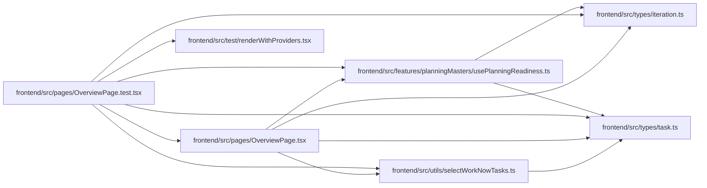

# OverviewPage.test Module

**Path:** `frontend/src/pages/OverviewPage.test.tsx`

## Description

_Auto-generated from `frontend/src/pages/OverviewPage.test.tsx`._

## Imports

| Source | Symbols |
|--------|---------|
| `../features/planningMasters/usePlanningReadiness` | `PlanningTeamMember` |
| `../test/renderWithProviders` | `renderWithProviders` |
| `../types/iteration` | `Iteration`, `IterationSummary` |
| `../types/task` | `Task`, `TaskStatus` |
| `../utils/selectWorkNowTasks` | `selectWorkNowTasks` |
| `./OverviewPage` | `OverviewPage` |
| `@testing-library/react` | `screen`, `waitFor`, `within` |
| `@testing-library/user-event` | `UserEvent` |
| `vitest` | `afterEach`, `beforeEach`, `describe`, `expect`, `it`, `vi` |

## Module Signals

| Signal | Values |
|--------|--------|
| Constants | `planningReadinessMock`, `serviceMocks`, `iteration`, `iterationSummary` |
| Module calls | `planningReadinessMock = hoisted`, `serviceMocks = hoisted`, `mock`, `mock`, `mock`, `describe`, `describe` |

## Local dependency map

<!-- Auto-generated local dependency summary. Do not edit by hand. -->

### Internal neighbors

| Direction | Module |
|---|---|
| Outbound | [usePlanningReadiness](../modules/usePlanningReadiness.md) |
| Outbound | [OverviewPage](../modules/OverviewPage.md) |
| Outbound | [renderWithProviders](../modules/renderWithProviders.md) |
| Outbound | [types_iteration](../modules/types_iteration.md) |
| Outbound | [types_task](../modules/types_task.md) |
| Outbound | [selectWorkNowTasks](../modules/selectWorkNowTasks.md) |

### External packages

| Language | Used packages | Undeclared packages |
|---|---:|---:|
| typescript | 3 | 0 |
