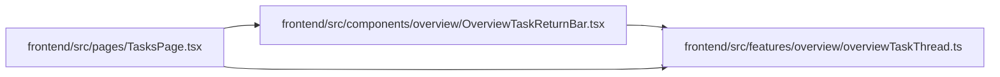

# OverviewTaskReturnBar Module

**Path:** `frontend/src/components/overview/OverviewTaskReturnBar.tsx`

## Description

_Auto-generated from `frontend/src/components/overview/OverviewTaskReturnBar.tsx`._

## Imports

| Source | Symbols |
|--------|---------|
| `../../features/overview/overviewTaskThread` | `overviewTaskReturnFocusId` |
| `lucide-react` | `ArrowLeft`, `Waypoints` |
| `react` | `RefObject` |
| `react-i18next` | `useTranslation` |
| `react-router-dom` | `Link` |

## Module Signals

| Signal | Values |
|--------|--------|
| Exports | `OverviewTaskReturnBar` |

## Local dependency map

<!-- Auto-generated local dependency summary. Do not edit by hand. -->

### Internal neighbors

| Direction | Module |
|---|---|
| Inbound | [TasksPage](../modules/TasksPage.md) |
| Outbound | [overviewTaskThread](../modules/overviewTaskThread.md) |

### External packages

| Language | Used packages | Undeclared packages |
|---|---:|---:|
| typescript | 4 | 0 |

## Functions

| Function | Signature | Decorators | Description |
|----------|-----------|------------|-------------|
| `OverviewTaskReturnBar` | `({     active,     taskId,     taskTitle,     returnActionRef, }: {     active: boolean;     taskId: number \| null;     taskTitle?: string \| null;     returnActionRef?: RefObject<HTMLAnchorElement \| null>; })` | — | — |
