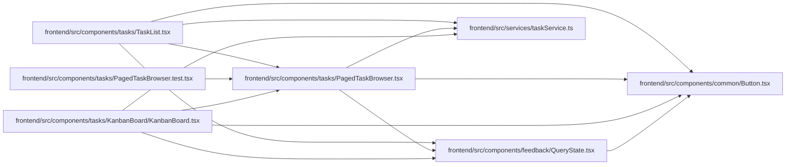

# PagedTaskBrowser Module

**Path:** `frontend/src/components/tasks/PagedTaskBrowser.tsx`

## Description

The complete-graph error offers ID-ordered task browsing with independent search/status controls and explicit load-more. Loaded references are advisory; planning filters and structural decisions require complete context. URL task selection survives continuation and opens the shared guarded editor. Failed reads hide cached private rows and requests honor cancellation.

_Auto-generated from `frontend/src/components/tasks/PagedTaskBrowser.tsx`._

## Imports

| Source | Symbols |
|--------|---------|
| `../../services/taskService` | `taskService` |
| `../common/Button` | `Button` |
| `../feedback/QueryState` | `QueryErrorState`, `QueryLoadingState` |
| `@tanstack/react-query` | `useInfiniteQuery` |
| `react` | `useState` |
| `react-i18next` | `useTranslation` |
| `react-router-dom` | `useSearchParams` |

## Module Signals

| Signal | Values |
|--------|--------|
| Exports | `PagedTaskBrowser` |

## Local dependency map

<!-- Auto-generated local dependency summary. Do not edit by hand. -->

### Internal neighbors

| Direction | Module |
|---|---|
| Inbound | [KanbanBoard](../modules/KanbanBoard.md) |
| Inbound | [PagedTaskBrowser.test](../modules/PagedTaskBrowser.test.md) |
| Inbound | [TaskList](../modules/TaskList.md) |
| Outbound | [Button](../modules/Button.md) |
| Outbound | [QueryState](../modules/QueryState.md) |
| Outbound | [taskService](../modules/taskService.md) |

### External packages

| Language | Used packages | Undeclared packages |
|---|---:|---:|
| typescript | 4 | 0 |

## Functions

| Function | Signature | Decorators | Description |
|----------|-----------|------------|-------------|
| `PagedTaskBrowser` | `({ iterationId }: { iterationId: number })` | — | — |
