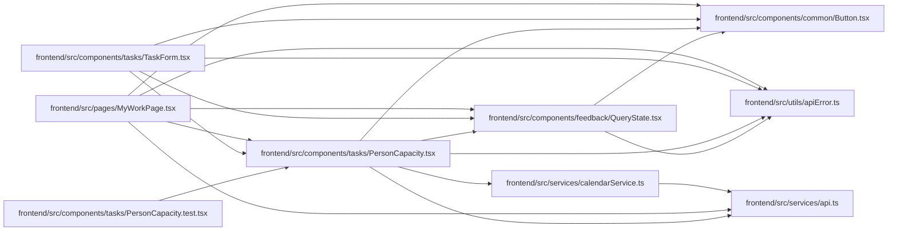

# PersonCapacity Module

**Path:** `frontend/src/components/tasks/PersonCapacity.tsx`

## Description

Displays server-derived daily availability, allocated and productive hours, saved commitments and uncertainty. Person owners can select a calendar and versioned absences. The interface preserves the established design and shows private work only through aggregate capacity.

Person calendar changes retain the opening availability revision across live refreshes. Changed server state requires an explicit current comparison before reapplication; pending absence and calendar writes retain input intent.

## Imports

| Source | Symbols |
|--------|---------|
| `../../services/api` | `api` |
| `../../services/calendarService` | `calendarService` |
| `../../utils/apiError` | `getApiErrorMessage` |
| `../common/Button` | `Button` |
| `../feedback/QueryState` | `QueryErrorState` |
| `@tanstack/react-query` | `useMutation`, `useQuery`, `useQueryClient` |
| `react` | `useId`, `useState` |
| `react-i18next` | `useTranslation` |

## Module Signals

| Signal | Values |
|--------|--------|
| Exports | `PersonCapacity` |

## Local dependency map

<!-- Auto-generated local dependency summary. Do not edit by hand. -->

### Internal neighbors

| Direction | Module |
|---|---|
| Inbound | [PersonCapacity.test](../modules/PersonCapacity.test.md) |
| Inbound | [TaskForm](../modules/TaskForm.md) |
| Inbound | [MyWorkPage](../modules/MyWorkPage.md) |
| Outbound | [Button](../modules/Button.md) |
| Outbound | [QueryState](../modules/QueryState.md) |
| Outbound | [api](../modules/api.md) |
| Outbound | [calendarService](../modules/calendarService.md) |
| Outbound | [apiError](../modules/apiError.md) |

### External packages

| Language | Used packages | Undeclared packages |
|---|---:|---:|
| typescript | 3 | 0 |

## Classes

| Class | Kind | Line | Bases / Target | Description |
|-------|------|------|----------------|-------------|
| [Absence](../entities/Absence.md) | Class | 10 | — | — |
| [Availability](../entities/Availability.md) | Class | 11 | — | — |
| [Capacity](../entities/Capacity.md) | Class | 12 | — | — |

## Functions

| Function | Signature | Decorators | Description |
|----------|-----------|------------|-------------|
| `PersonCapacity` | `({ profileId, startDate, endDate, manage = false }: { profileId: number; startDate?: string; endDate?: string; manage?: boolean })` | — | — |