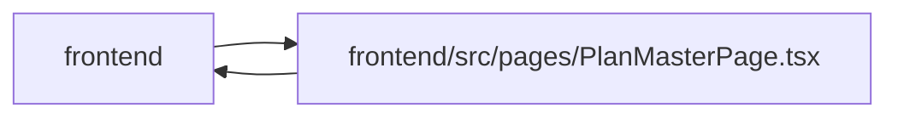

# PlanMasterPage Module

**Path:** `frontend/src/pages/PlanMasterPage.tsx`

## Description

_Auto-generated from `frontend/src/pages/PlanMasterPage.tsx`._

## Imports

| Source | Symbols |
|--------|---------|
| `../components/common/useConfirmDialog` | `useConfirmDialog` |
| `../components/feedback/QueryState` | `QueryErrorState`, `QueryLoadingState` |
| `../components/feedback/toast` | `useToast` |
| `../components/layout/Breadcrumbs` | `Breadcrumbs` |
| `../components/ui/MasterProgress` | `MasterProgress` |
| `../features/planningMasters/masters` | `derivePlanningRecovery`, `localizeStatus`, `readiness`, `STEP_DEFS`, `nextStep`, `PlanReadiness`, `StepStatus` |
| `../features/planningMasters/planningReturn` | `isPlanningStepId`, `withPlanMasterReturn`, `PlanningStepId` |
| `../features/planningMasters/planningTaskIssues` | `PLANNING_ITERATION_PARAM`, `planningIssueTasksHref`, `PlanningTaskIssue` |
| `../features/planningMasters/usePlanningReadiness` | `usePlanningReadiness`, `PlanningQueryFeedback` |
| `../services/planShareService` | `planShareService`, `PlanShare` |
| `../utils/copyText` | `copyText` |
| `../utils/focusLifecycle` | `captureFocusOrigin`, `focusOwnedTarget` |
| `../utils/formatDate` | `formatDate`, `formatDateTime` |
| `@tanstack/react-query` | `useMutation`, `useQuery`, `useQueryClient` |
| `lucide-react` | `ArrowRight`, `CalendarRange`, `Check`, `Copy`, `ExternalLink`, `GanttChartSquare`, `ListChecks`, `RefreshCw`, `Share2`, `ShieldAlert`, `Users` |
| `react` | `useCallback`, `useEffect`, `useMemo`, `useRef`, `useState`, `ReactNode`, `RefObject` |
| `react-i18next` | `useTranslation` |
| `react-router-dom` | `Link`, `useSearchParams` |

## Module Signals

| Signal | Values |
|--------|--------|
| Exports | `default` |
| Constants | `STEP_ICONS`, `STEP_STATE_LABEL_KEYS`, `STEP_PRESENTATION_LABEL_KEYS` |

## Local dependency map

<!-- Auto-generated local dependency summary. Do not edit by hand. -->

> Module-level dependencies exceed the generated-diagram limits, so the diagram and table below group them by top-level package. Counts report the number of module neighbors in each package.

### Internal neighbors

| Direction | Module |
|---|---|
| Inbound | `frontend` (1) |
| Outbound | `frontend` (13) |

### External packages

| Language | Used packages | Undeclared packages |
|---|---:|---:|
| typescript | 5 | 0 |

> All 14 module neighbor(s) are summarized by package because the module-level view exceeds the 12-node limit.

## Classes

| Class | Kind | Line | Bases / Target | Description |
|-------|------|------|----------------|-------------|
| [RecoveryFocusIntent](../entities/RecoveryFocusIntent.md) | Class | 75 | — | — |
| [ShareFocusIntent](../entities/ShareFocusIntent.md) | Class | 82 | — | — |
| [StepDataState](../entities/StepDataState.md) | Type alias | 56 | — | — |
| [EvidenceItem](../entities/EvidenceItem.md) | Type alias | 64 | — | — |
| [RecoveryFocusTarget](../entities/RecoveryFocusTarget.md) | Type alias | 72 | — | — |
| [ShareFocusTarget](../entities/ShareFocusTarget.md) | Type alias | 73 | — | — |
| [StepPresentationState](../entities/StepPresentationState.md) | Type alias | 104 | — | — |
