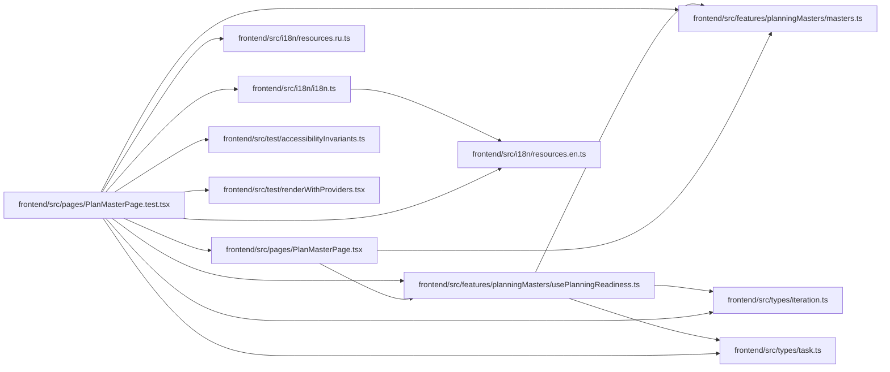

# PlanMasterPage.test Module

**Path:** `frontend/src/pages/PlanMasterPage.test.tsx`

## Description

_Auto-generated from `frontend/src/pages/PlanMasterPage.test.tsx`._

## Imports

| Source | Symbols |
|--------|---------|
| `../features/planningMasters/masters` | `deriveStatus`, `EMPTY_READINESS`, `nextStep`, `readiness`, `PlanReadiness` |
| `../features/planningMasters/usePlanningReadiness` | `PlanningQueryFeedback` |
| `../i18n/i18n` | `i18n` |
| `../i18n/resources.en` | `englishResources` |
| `../i18n/resources.ru` | `russianResources` |
| `../test/accessibilityInvariants` | `accessibleNameViolations` |
| `../test/renderWithProviders` | `renderWithProviders` |
| `../types/iteration` | `Iteration` |
| `../types/task` | `Task` |
| `./PlanMasterPage` | `PlanMasterPage` |
| `./PlanMasterPage.tsx?raw` | `planMasterSource` |
| `@testing-library/react` | `act`, `screen`, `waitFor`, `within` |
| `vitest` | `afterEach`, `beforeEach`, `describe`, `expect`, `it`, `vi` |

## Module Signals

| Signal | Values |
|--------|--------|
| Constants | `planningReadinessMock`, `planShareServiceMock`, `iteration`, `member` |
| Module calls | `planningReadinessMock = hoisted`, `planShareServiceMock = hoisted`, `mock`, `mock`, `describe` |

## Local dependency map

<!-- Auto-generated local dependency summary. Do not edit by hand. -->

### Internal neighbors

| Direction | Module |
|---|---|
| Outbound | [planningMasters_masters](../modules/planningMasters_masters.md) |
| Outbound | [usePlanningReadiness](../modules/usePlanningReadiness.md) |
| Outbound | [i18n](../modules/i18n.md) |
| Outbound | [resources.en](../modules/resources.en.md) |
| Outbound | [resources.ru](../modules/resources.ru.md) |
| Outbound | [PlanMasterPage](../modules/PlanMasterPage.md) |
| Outbound | [accessibilityInvariants](../modules/accessibilityInvariants.md) |
| Outbound | [renderWithProviders](../modules/renderWithProviders.md) |
| Outbound | [types_iteration](../modules/types_iteration.md) |
| Outbound | [types_task](../modules/types_task.md) |

### External packages

| Language | Used packages | Undeclared packages |
|---|---:|---:|
| typescript | 2 | 0 |

## Classes

| Class | Kind | Line | Bases / Target | Description |
|-------|------|------|----------------|-------------|
| [QueryKey](../entities/QueryKey.md) | Type alias | 35 | — | — |
| [PlanningMember](../entities/PlanningMember.md) | Type alias | 36 | — | — |
