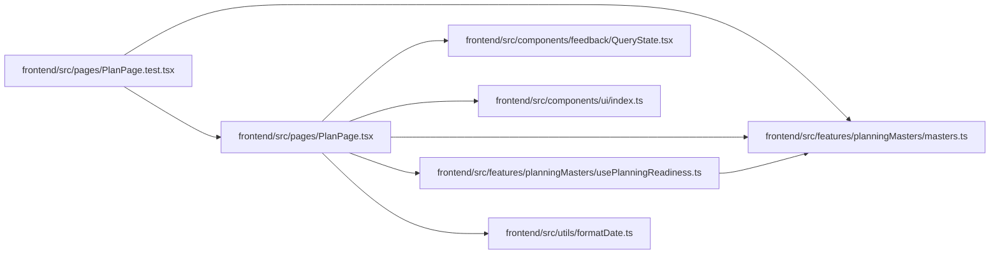

# PlanPage Module

**Path:** `frontend/src/pages/PlanPage.tsx`

## Description

_Auto-generated from `frontend/src/pages/PlanPage.tsx`._

## Imports

| Source | Symbols |
|--------|---------|
| `../components/feedback/QueryState` | `QueryErrorState`, `QueryLoadingState` |
| `../components/ui` | `PageHeader`, `PageLayout` |
| `../features/planningMasters/masters` | `localizeStatus`, `STEP_DEFS` |
| `../features/planningMasters/usePlanningReadiness` | `usePlanningReadiness` |
| `../utils/formatDate` | `formatDate` |
| `lucide-react` | `ArrowRight`, `CalendarRange`, `Check`, `ChevronDown`, `GanttChartSquare`, `Inbox`, `Layers`, `ListTodo`, `LockKeyhole`, `RefreshCw`, `Sparkles`, `TriangleAlert`, `Users`, `LucideIcon` |
| `react` | `useState` |
| `react-i18next` | `useTranslation` |
| `react-router-dom` | `Link` |

## Module Signals

| Signal | Values |
|--------|--------|
| Exports | `default` |

## Local dependency map

<!-- Auto-generated local dependency summary. Do not edit by hand. -->

### Internal neighbors

| Direction | Module |
|---|---|
| Inbound | [PlanPage.test](../modules/PlanPage.test.md) |
| Outbound | [QueryState](../modules/QueryState.md) |
| Outbound | [index](../modules/index.md) |
| Outbound | [planningMasters_masters](../modules/planningMasters_masters.md) |
| Outbound | [usePlanningReadiness](../modules/usePlanningReadiness.md) |
| Outbound | [formatDate](../modules/formatDate.md) |

### External packages

| Language | Used packages | Undeclared packages |
|---|---:|---:|
| typescript | 4 | 0 |

## Classes

| Class | Kind | Line | Bases / Target | Description |
|-------|------|------|----------------|-------------|
| [LocalizedStepStatus](../entities/LocalizedStepStatus.md) | Type alias | 26 | — | — |
| [PlanningJob](../entities/PlanningJob.md) | Type alias | 32 | — | — |
| [RefreshStatus](../entities/RefreshStatus.md) | Type alias | 41 | — | — |
