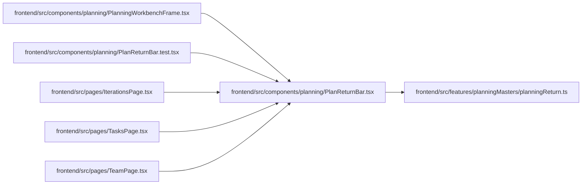

# PlanReturnBar Module

**Path:** `frontend/src/components/planning/PlanReturnBar.tsx`

## Description

_Auto-generated from `frontend/src/components/planning/PlanReturnBar.tsx`._

## Imports

| Source | Symbols |
|--------|---------|
| `../../features/planningMasters/planningReturn` | `isPlanningStepId`, `planMasterStepHref`, `PLANNING_RETURN_STEP_PARAM` |
| `lucide-react` | `ArrowLeft`, `Waypoints` |
| `react-i18next` | `useTranslation` |
| `react-router-dom` | `Link`, `useSearchParams` |

## Module Signals

| Signal | Values |
|--------|--------|
| Exports | `PlanReturnBar` |

## Local dependency map

<!-- Auto-generated local dependency summary. Do not edit by hand. -->

### Internal neighbors

| Direction | Module |
|---|---|
| Inbound | [PlanningWorkbenchFrame](../modules/PlanningWorkbenchFrame.md) |
| Inbound | [PlanReturnBar.test](../modules/PlanReturnBar.test.md) |
| Inbound | [IterationsPage](../modules/IterationsPage.md) |
| Inbound | [TasksPage](../modules/TasksPage.md) |
| Inbound | [TeamPage](../modules/TeamPage.md) |
| Outbound | [planningReturn](../modules/planningReturn.md) |

### External packages

| Language | Used packages | Undeclared packages |
|---|---:|---:|
| typescript | 3 | 0 |

## Functions

| Function | Signature | Decorators | Description |
|----------|-----------|------------|-------------|
| `PlanReturnBar` | `()` | — | — |
