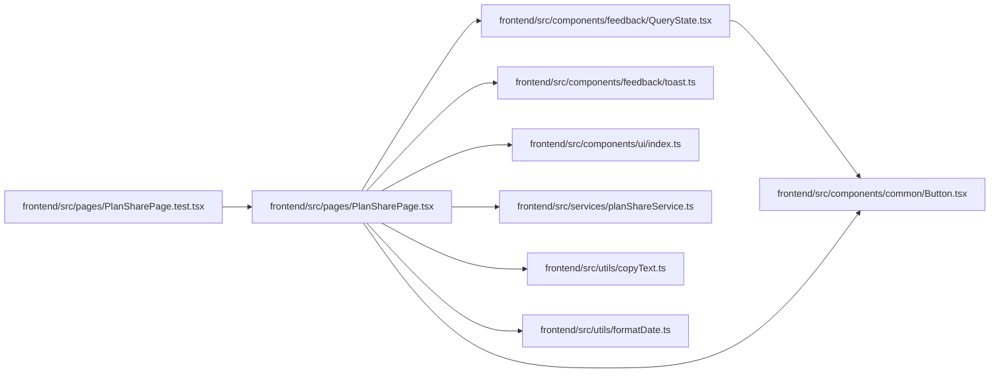

# PlanSharePage Module

**Path:** `frontend/src/pages/PlanSharePage.tsx`

## Description

_Auto-generated from `frontend/src/pages/PlanSharePage.tsx`._

## Imports

| Source | Symbols |
|--------|---------|
| `../components/common/Button` | `Button` |
| `../components/feedback/QueryState` | `QueryErrorState`, `QueryLoadingState` |
| `../components/feedback/toast` | `useToast` |
| `../components/ui` | `PageHeader`, `PageLayout` |
| `../services/planShareService` | `planShareService`, `PlanShareTask` |
| `../utils/copyText` | `copyText` |
| `../utils/formatDate` | `formatDate`, `formatDateTime` |
| `@tanstack/react-query` | `useQuery` |
| `lucide-react` | `CalendarDays`, `CheckCircle2`, `Copy`, `ExternalLink`, `ListChecks`, `Users` |
| `react` | `useMemo` |
| `react-i18next` | `useTranslation` |
| `react-router-dom` | `Link`, `useParams` |

## Module Signals

| Signal | Values |
|--------|--------|
| Exports | `default` |

## Local dependency map

<!-- Auto-generated local dependency summary. Do not edit by hand. -->

### Internal neighbors

| Direction | Module |
|---|---|
| Inbound | [PlanSharePage.test](../modules/PlanSharePage.test.md) |
| Outbound | [Button](../modules/Button.md) |
| Outbound | [QueryState](../modules/QueryState.md) |
| Outbound | [toast](../modules/toast.md) |
| Outbound | [index](../modules/index.md) |
| Outbound | [planShareService](../modules/planShareService.md) |
| Outbound | [copyText](../modules/copyText.md) |
| Outbound | [formatDate](../modules/formatDate.md) |

### External packages

| Language | Used packages | Undeclared packages |
|---|---:|---:|
| typescript | 5 | 0 |
