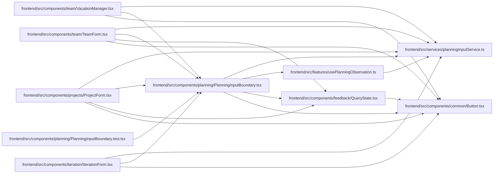

# PlanningInputBoundary Module

**Path:** `frontend/src/components/planning/PlanningInputBoundary.tsx`

## Description

Existing planning editors start from one coherent server resource and complete revision map. Explicit comparison retains user input; explicit reload starts a new editor generation. Scope and permission failures remain visible, and denied observations remove server data. Pending editors disable comparison controls.

## Imports

| Source | Symbols |
|--------|---------|
| `../../features/usePlanningObservation` | `usePlanningObservation` |
| `../../services/planningInputService` | `MemberPlanningIntent`, `ObservedPlanningInput`, `PlanningInputKind` |
| `../common/Button` | `Button` |
| `../feedback/QueryState` | `QueryErrorState`, `QueryLoadingState` |
| `react` | `useEffect`, `useState`, `ReactNode` |
| `react-i18next` | `useTranslation` |

## Module Signals

| Signal | Values |
|--------|--------|
| Exports | `PlanningInputBoundary` |

## Local dependency map

<!-- Auto-generated local dependency summary. Do not edit by hand. -->

### Internal neighbors

| Direction | Module |
|---|---|
| Inbound | [IterationForm](../modules/IterationForm.md) |
| Inbound | [PlanningInputBoundary.test](../modules/PlanningInputBoundary.test.md) |
| Inbound | [ProjectForm](../modules/ProjectForm.md) |
| Inbound | [TeamForm](../modules/TeamForm.md) |
| Inbound | [VacationManager](../modules/VacationManager.md) |
| Outbound | [Button](../modules/Button.md) |
| Outbound | [QueryState](../modules/QueryState.md) |
| Outbound | [usePlanningObservation](../modules/usePlanningObservation.md) |
| Outbound | [planningInputService](../modules/planningInputService.md) |

### External packages

| Language | Used packages | Undeclared packages |
|---|---:|---:|
| typescript | 2 | 0 |

## Functions

| Function | Signature | Decorators | Description |
|----------|-----------|------------|-------------|
| `PlanningInputBoundary` | `({ kind, resourceId, creatingMember = false, getIntent, onCancel, children }: {     kind: PlanningInputKind; resourceId: number; creatingMember?: boolean;     onCancel?: () => void;     getIntent?: () => MemberPlanningIntent;     children: (observation: ObservedPlanningInput<T>, controls: ReactNode, onSaved: () => void) => ReactNode; })` | — | — |
