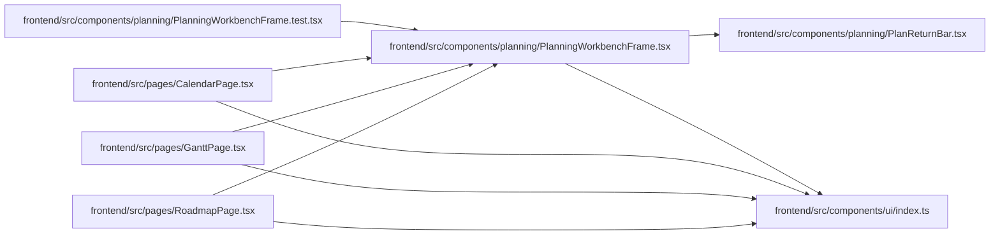

# PlanningWorkbenchFrame Module

**Path:** `frontend/src/components/planning/PlanningWorkbenchFrame.tsx`

## Description

_Auto-generated from `frontend/src/components/planning/PlanningWorkbenchFrame.tsx`._

## Imports

| Source | Symbols |
|--------|---------|
| `../ui` | `PageHeader`, `PageLayout` |
| `./PlanReturnBar` | `PlanReturnBar` |
| `clsx` | `clsx` |
| `react` | `ReactNode` |

## Module Signals

| Signal | Values |
|--------|--------|
| Exports | `PlanningWorkbenchFact`, `PlanningWorkbenchFrame` |

## Local dependency map

<!-- Auto-generated local dependency summary. Do not edit by hand. -->

### Internal neighbors

| Direction | Module |
|---|---|
| Inbound | [PlanningWorkbenchFrame.test](../modules/PlanningWorkbenchFrame.test.md) |
| Inbound | [CalendarPage](../modules/CalendarPage.md) |
| Inbound | [GanttPage](../modules/GanttPage.md) |
| Inbound | [RoadmapPage](../modules/RoadmapPage.md) |
| Outbound | [PlanReturnBar](../modules/PlanReturnBar.md) |
| Outbound | [index](../modules/index.md) |

### External packages

| Language | Used packages | Undeclared packages |
|---|---:|---:|
| typescript | 2 | 0 |

## Classes

| Class | Kind | Line | Bases / Target | Description |
|-------|------|------|----------------|-------------|
| [PlanningWorkbenchFact](../entities/PlanningWorkbenchFact.md) | Type alias | 6 | — | — |
| [PlanningWorkbenchFrameProps](../entities/PlanningWorkbenchFrameProps.md) | Type alias | 12 | — | — |

## Functions

| Function | Signature | Decorators | Description |
|----------|-----------|------------|-------------|
| `PlanningWorkbenchFrame` | `({     title,     description,     facts = [],     contextControl,     secondaryActions,     primaryAction,     overflowAction,     state,     children,     variant = 'default',     className,     headerClassName,     canvasClassName,     testId, }: PlanningWorkbenchFrameProps)` | — | — |
