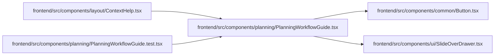

# PlanningWorkflowGuide Module

**Path:** `frontend/src/components/planning/PlanningWorkflowGuide.tsx`

## Description

_Auto-generated from `frontend/src/components/planning/PlanningWorkflowGuide.tsx`._

## Imports

| Source | Symbols |
|--------|---------|
| `../common/Button` | `Button` |
| `../ui/SlideOverDrawer` | `SlideOverDrawer` |
| `lucide-react` | `CalendarClock`, `ChevronRight`, `CircleHelp`, `FlaskConical`, `History`, `ListChecks`, `LockKeyhole`, `Share2`, `LucideIcon` |
| `react` | `useState` |
| `react-i18next` | `useTranslation` |
| `react-router-dom` | `Link` |

## Module Signals

| Signal | Values |
|--------|--------|
| Exports | `PlanningWorkflowGuide`, `PlanningWorkflowHelpContent` |

## Local dependency map

<!-- Auto-generated local dependency summary. Do not edit by hand. -->

### Internal neighbors

| Direction | Module |
|---|---|
| Inbound | [ContextHelp](../modules/ContextHelp.md) |
| Inbound | [PlanningWorkflowGuide.test](../modules/PlanningWorkflowGuide.test.md) |
| Outbound | [Button](../modules/Button.md) |
| Outbound | [SlideOverDrawer](../modules/SlideOverDrawer.md) |

### External packages

| Language | Used packages | Undeclared packages |
|---|---:|---:|
| typescript | 4 | 0 |

## Classes

| Class | Kind | Line | Bases / Target | Description |
|-------|------|------|----------------|-------------|
| [PlanningSurface](../entities/PlanningSurface.md) | Type alias | 18 | — | — |
| [GuideItem](../entities/GuideItem.md) | Type alias | 20 | — | — |

## Functions

| Function | Signature | Decorators | Description |
|----------|-----------|------------|-------------|
| `PlanningWorkflowHelpContent` | `({     surface,     showAction = true,     onNavigate, }: {     surface: PlanningSurface;     showAction?: boolean;     onNavigate?: () => void; })` | — | — |
| `PlanningWorkflowGuide` | `({ surface }: { surface: PlanningSurface })` | — | — |
