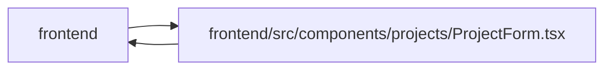

# ProjectForm Module

**Path:** `frontend/src/components/projects/ProjectForm.tsx`

## Description

_Auto-generated from `frontend/src/components/projects/ProjectForm.tsx`._

## Imports

| Source | Symbols |
|--------|---------|
| `../../i18n/seedDisplay` | `templateDisplay` |
| `../../services/projectService` | `projectService` |
| `../../services/teamService` | `teamService` |
| `../../services/templateService` | `templateService` |
| `../../types/project` | `Project`, `ProjectCreate`, `ProjectHealth`, `ProjectStatus` |
| `../../types/template` | `WorkTemplate` |
| `../../utils/apiError` | `getApiErrorMessage` |
| `../../utils/teamMemberLabels` | `formatTeamMemberProfileLabel` |
| `../../utils/templateDefaults` | `appendChecklistToDescription`, `getPayloadNumber` |
| `../common/Button` | `Button` |
| `../common/CollapsibleSection` | `CollapsibleSection` |
| `../common/Input` | `Input` |
| `../feedback/QueryState` | `QueryErrorState`, `QueryLoadingState` |
| `@tanstack/react-query` | `useMutation`, `useQuery`, `useQueryClient` |
| `lucide-react` | `Save` |
| `react` | `useState` |
| `react-i18next` | `useTranslation` |

## Module Signals

| Signal | Values |
|--------|--------|
| Exports | `ProjectForm` |
| Constants | `statusOptions`, `healthOptions`, `projectStatusValues`, `projectHealthValues` |
| Module calls | `projectStatusValues = map`, `projectHealthValues = map` |

## Local dependency map

<!-- Auto-generated local dependency summary. Do not edit by hand. -->

> Module-level dependencies exceed the generated-diagram limits, so the diagram and table below group them by top-level package. Counts report the number of module neighbors in each package.

### Internal neighbors

| Direction | Module |
|---|---|
| Inbound | `frontend` (2) |
| Outbound | `frontend` (13) |

### External packages

| Language | Used packages | Undeclared packages |
|---|---:|---:|
| typescript | 4 | 0 |

> All 15 module neighbor(s) are summarized by package because the module-level view exceeds the 12-node limit.

## Classes

| Class | Kind | Line | Bases / Target | Description |
|-------|------|------|----------------|-------------|
| [ProjectFormProps](../entities/ProjectFormProps.md) | Class | 22 | — | — |

## Functions

| Function | Signature | Decorators | Description |
|----------|-----------|------------|-------------|
| `ProjectForm` | `({ initialData, onSuccess, onCancel }: ProjectFormProps)` | — | — |
