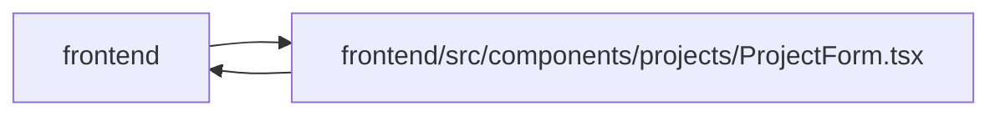

# ProjectForm Module

**Path:** `frontend/src/components/projects/ProjectForm.tsx`

## Description

_Auto-generated from `frontend/src/components/projects/ProjectForm.tsx`._

## Imports

| Source | Symbols | Type-only | Runtime emission |
|--------|---------|-----------|------------------|
| `../../features/mutationFeedback` | `MutationFeedbackMeta` | Declaration | erased |
| `../../features/mutationFeedback` | `feedbackMessage` | — | compiler-dependent |
| `../../i18n/seedDisplay` | `templateDisplay` | — | compiler-dependent |
| `../../services/planningInputService` | `ObservedRevisions` | Declaration | erased |
| `../../services/projectService` | `projectService` | — | compiler-dependent |
| `../../services/teamService` | `teamService` | — | compiler-dependent |
| `../../services/templateService` | `templateService` | — | compiler-dependent |
| `../../types/project` | `Project`, `ProjectCreate`, `ProjectHealth`, `ProjectStatus` | Declaration | erased |
| `../../types/template` | `WorkTemplate` | Declaration | erased |
| `../../utils/apiError` | `getApiErrorMessage`, `getApiErrorStatus` | — | compiler-dependent |
| `../../utils/teamMemberLabels` | `formatTeamMemberProfileLabel` | — | compiler-dependent |
| `../../utils/templateDefaults` | `appendChecklistToDescription`, `getPayloadNumber` | — | compiler-dependent |
| `../common/Button` | `Button` | — | compiler-dependent |
| `../common/CollapsibleSection` | `CollapsibleSection` | — | compiler-dependent |
| `../common/Input` | `Input` | — | compiler-dependent |
| `../feedback/QueryState` | `QueryErrorState`, `QueryLoadingState` | — | compiler-dependent |
| `../planning/PlanningInputBoundary` | `PlanningInputBoundary` | — | compiler-dependent |
| `../tasks/useDraftDismissal` | `useActiveMount` | — | compiler-dependent |
| `@tanstack/react-query` | `useMutation`, `useQuery`, `useQueryClient` | — | compiler-dependent |
| `lucide-react` | `Save` | — | compiler-dependent |
| `react` | `ReactNode` | Declaration | erased |
| `react` | `useState` | — | compiler-dependent |
| `react-i18next` | `useTranslation` | — | compiler-dependent |

## Module Signals

| Signal | Values |
|--------|--------|
| Exports | `ProjectForm` |
| Constants | `statusOptions`, `healthOptions`, `projectStatusValues`, `projectHealthValues` |
| Module calls | `projectStatusValues = map`, `projectHealthValues = map` |

## Local dependency map

<!-- Auto-generated local dependency summary. Do not edit by hand. -->
This graph shows full source coupling. Type dependencies can be erased; compiler-dependent cycle groups are runtime candidates, not confirmed initialization cycles.

```mermaid
flowchart LR
    n0["frontend"]
    n1["frontend/src/components/projects/ProjectForm.tsx"]
    n0 --> n1
    n1 --> n0
    click n1 "../modules/ProjectForm.md"
```

> Module-level dependencies exceed the generated-diagram limits, so the diagram and table below group them by top-level package. Counts report the number of module neighbors in each package.

### Internal neighbors

| Direction | Module |
|---|---|
| Inbound | `frontend` (3) |
| Outbound | `frontend` (17) |

### External packages

| Language | Used packages | Undeclared packages |
|---|---:|---:|
| typescript | 4 | 0 |

> All 20 module neighbor(s) are summarized by package because the module-level view exceeds the 12-node limit.

## Classes

| Class | Kind | Line | Bases / Target | Description |
|-------|------|------|----------------|-------------|
| [ProjectFormProps](../entities/ProjectFormProps.md) | Interface | 28 | — | — |

## Functions

| Function | Signature | Decorators | Description |
|----------|-----------|------------|-------------|
| `ProjectForm` | `(props: ProjectFormProps)` | — | — |
