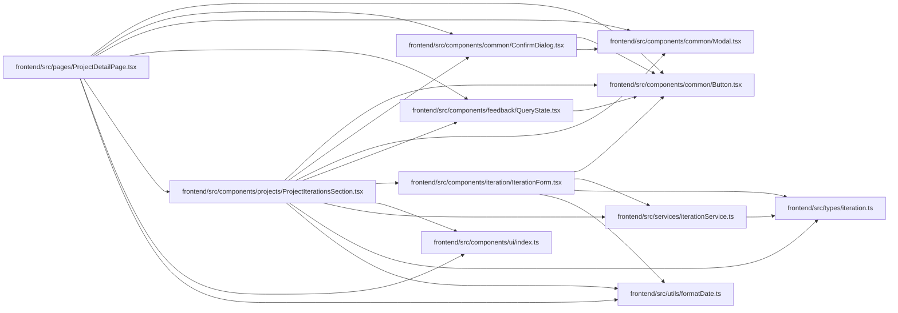

# ProjectIterationsSection Module

**Path:** `frontend/src/components/projects/ProjectIterationsSection.tsx`

## Description

_Auto-generated from `frontend/src/components/projects/ProjectIterationsSection.tsx`._

## Imports

| Source | Symbols |
|--------|---------|
| `../../services/iterationService` | `iterationService` |
| `../../types/iteration` | `Iteration` |
| `../../utils/formatDate` | `formatDate` |
| `../common/Button` | `Button` |
| `../common/ConfirmDialog` | `ConfirmDialog` |
| `../common/Modal` | `Modal` |
| `../feedback/QueryState` | `QueryErrorState` |
| `../iteration/IterationForm` | `IterationForm` |
| `../ui` | `InlineEmptyState`, `SectionCard` |
| `@tanstack/react-query` | `useMutation`, `useQuery`, `useQueryClient` |
| `lucide-react` | `CalendarDays`, `Link2`, `Pencil`, `Plus`, `Unlink` |
| `react` | `useMemo`, `useState` |
| `react-i18next` | `useTranslation` |

## Module Signals

| Signal | Values |
|--------|--------|
| Exports | `ProjectIterationsSection` |

## Local dependency map

<!-- Auto-generated local dependency summary. Do not edit by hand. -->

### Internal neighbors

| Direction | Module |
|---|---|
| Inbound | [ProjectDetailPage](../modules/ProjectDetailPage.md) |
| Outbound | [Button](../modules/Button.md) |
| Outbound | [ConfirmDialog](../modules/ConfirmDialog.md) |
| Outbound | [Modal](../modules/Modal.md) |
| Outbound | [QueryState](../modules/QueryState.md) |
| Outbound | [IterationForm](../modules/IterationForm.md) |
| Outbound | [index](../modules/index.md) |
| Outbound | [iterationService](../modules/iterationService.md) |
| Outbound | [types_iteration](../modules/types_iteration.md) |
| Outbound | [formatDate](../modules/formatDate.md) |

### External packages

| Language | Used packages | Undeclared packages |
|---|---:|---:|
| typescript | 4 | 0 |

## Classes

| Class | Kind | Line | Bases / Target | Description |
|-------|------|------|----------------|-------------|
| [ProjectIterationsSectionProps](../entities/ProjectIterationsSectionProps.md) | Class | 15 | — | — |
| [IterationEditorState](../entities/IterationEditorState.md) | Type alias | 22 | — | — |

## Functions

| Function | Signature | Decorators | Description |
|----------|-----------|------------|-------------|
| `ProjectIterationsSection` | `({     projectId,     projectName,     iterations,     isLoading, }: ProjectIterationsSectionProps)` | — | — |
