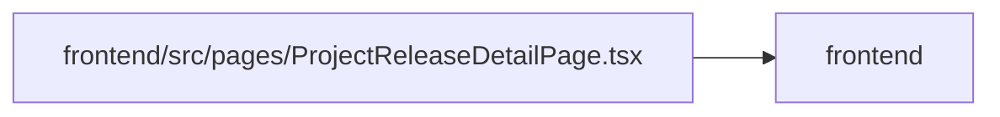

# ProjectReleaseDetailPage Module

**Path:** `frontend/src/pages/ProjectReleaseDetailPage.tsx`

## Description

_Auto-generated from `frontend/src/pages/ProjectReleaseDetailPage.tsx`._

## Imports

| Source | Symbols |
|--------|---------|
| `../components/common/Button` | `Button` |
| `../components/common/Modal` | `Modal` |
| `../components/feedback/QueryState` | `QueryErrorState` |
| `../components/layout/Breadcrumbs` | `Breadcrumbs` |
| `../components/releases/ReleaseForm` | `ReleaseForm` |
| `../components/tasks/WorkMetricsLine` | `WorkMetricsLine` |
| `../components/ui` | `MetricGrid`, `PageHeader`, `PageLayout` |
| `../components/ui/tone` | `isTaskStatus`, `pillToneClassName`, `STATUS_TONE`, `statusTextClassName` |
| `../services/projectService` | `projectService` |
| `../services/releaseService` | `releaseService` |
| `../types/release` | `Release`, `ReleaseStatus`, `ReleaseTaskSummary` |
| `../utils/apiError` | `getApiErrorMessage` |
| `../utils/formatDate` | `formatDate`, `formatDateTime` |
| `@tanstack/react-query` | `useMutation`, `useQuery`, `useQueryClient` |
| `clsx` | `clsx` |
| `lucide-react` | `CalendarDays`, `CheckCircle2`, `Clock`, `Edit`, `FolderOpen`, `Package`, `Tag` |
| `react` | `useState` |
| `react-i18next` | `useTranslation` |
| `react-router-dom` | `useNavigate`, `useParams` |

## Module Signals

| Signal | Values |
|--------|--------|
| Exports | `default` |
| Constants | `releaseStatusLabelKeys` |

## Local dependency map

<!-- Auto-generated local dependency summary. Do not edit by hand. -->

> Module-level dependencies exceed the generated-diagram limits, so the diagram and table below group them by top-level package. Counts report the number of module neighbors in each package.

### Internal neighbors

| Direction | Module |
|---|---|
| Outbound | `frontend` (13) |

### External packages

| Language | Used packages | Undeclared packages |
|---|---:|---:|
| typescript | 6 | 0 |

> All 13 module neighbor(s) are summarized by package because the module-level view exceeds the 12-node limit.
