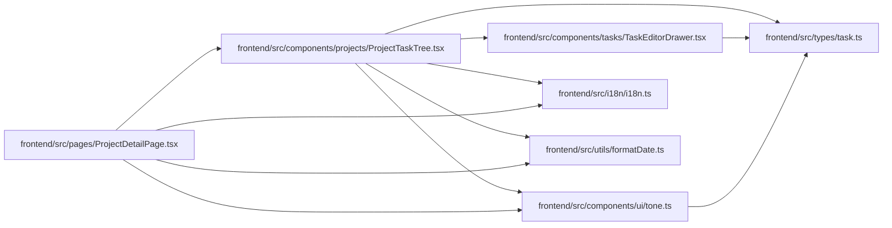

# ProjectTaskTree Module

**Path:** `frontend/src/components/projects/ProjectTaskTree.tsx`

## Description

_Auto-generated from `frontend/src/components/projects/ProjectTaskTree.tsx`._

## Imports

| Source | Symbols |
|--------|---------|
| `../../i18n/i18n` | `i18n` |
| `../../types/task` | `Task` |
| `../../utils/formatDate` | `formatDate` |
| `../tasks/TaskEditorDrawer` | `TaskEditorDrawer` |
| `../ui/tone` | `pillToneClassName`, `STATUS_TONE`, `statusTextClassName` |
| `clsx` | `clsx` |
| `lucide-react` | `AlertTriangle`, `CheckCircle2`, `Circle`, `CornerDownRight`, `MessageSquare`, `User` |
| `react` | `useState` |

## Module Signals

| Signal | Values |
|--------|--------|
| Exports | `ProjectTaskTree` |
| Constants | `t` |
| Module calls | `t = bind` |

## Local dependency map

<!-- Auto-generated local dependency summary. Do not edit by hand. -->

### Internal neighbors

| Direction | Module |
|---|---|
| Inbound | [ProjectDetailPage](../modules/ProjectDetailPage.md) |
| Outbound | [TaskEditorDrawer](../modules/TaskEditorDrawer.md) |
| Outbound | [tone](../modules/tone.md) |
| Outbound | [i18n](../modules/i18n.md) |
| Outbound | [types_task](../modules/types_task.md) |
| Outbound | [formatDate](../modules/formatDate.md) |

### External packages

| Language | Used packages | Undeclared packages |
|---|---:|---:|
| typescript | 3 | 0 |

## Classes

| Class | Kind | Line | Bases / Target | Description |
|-------|------|------|----------------|-------------|
| [ProjectTaskTreeProps](../entities/ProjectTaskTreeProps.md) | Class | 19 | — | — |

## Functions

| Function | Signature | Decorators | Description |
|----------|-----------|------------|-------------|
| `ProjectTaskTree` | `({ tasks }: ProjectTaskTreeProps)` | — | — |
