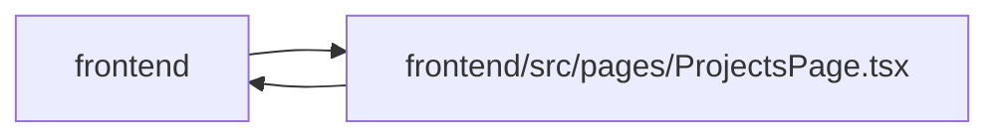

# ProjectsPage Module

**Path:** `frontend/src/pages/ProjectsPage.tsx`

## Description

_Auto-generated from `frontend/src/pages/ProjectsPage.tsx`._

## Imports

| Source | Symbols |
|--------|---------|
| `../components/common/Button` | `Button` |
| `../components/common/Input` | `Input` |
| `../components/common/Modal` | `Modal` |
| `../components/common/useConfirmDialog` | `useConfirmDialog` |
| `../components/feedback/QueryState` | `QueryErrorState`, `QueryLoadingState`, `QueryStaleState` |
| `../components/projects/InitiativeForm` | `InitiativeForm` |
| `../components/projects/ProjectForm` | `ProjectForm` |
| `../components/projects/projectStatusStyles` | `projectStatusBadgeClassName` |
| `../components/ui` | `InlineEmptyState`, `PageHeader`, `PageLayout`, `TableFrame` |
| `../services/projectService` | `projectService` |
| `../services/savedViewService` | `savedViewService` |
| `../types/project` | `Initiative`, `Project`, `ProjectHealth`, `ProjectPortfolioSummary`, `ProjectStatus` |
| `../types/savedView` | `SavedView` |
| `../utils/apiError` | `getApiErrorMessage` |
| `../utils/formatDate` | `formatDate` |
| `../utils/teamMemberLabels` | `formatPortfolioOwnerLabel` |
| `@tanstack/react-query` | `useMutation`, `useQuery`, `useQueryClient` |
| `clsx` | `clsx` |
| `lucide-react` | `AlertTriangle`, `ChevronDown`, `FolderOpen`, `LoaderCircle`, `Plus`, `Search`, `Target` |
| `react` | `useCallback`, `useEffect`, `useMemo`, `useRef`, `useState` |
| `react-i18next` | `useTranslation` |
| `react-router-dom` | `Link`, `useNavigate`, `useSearchParams` |

## Module Signals

| Signal | Values |
|--------|--------|
| Exports | `default` |
| Constants | `projectStatusLabelKeys`, `projectHealthLabelKeys`, `riskLabelKeys` |

## Local dependency map

<!-- Auto-generated local dependency summary. Do not edit by hand. -->

> Module-level dependencies exceed the generated-diagram limits, so the diagram and table below group them by top-level package. Counts report the number of module neighbors in each package.

### Internal neighbors

| Direction | Module |
|---|---|
| Inbound | `frontend` (1) |
| Outbound | `frontend` (16) |

### External packages

| Language | Used packages | Undeclared packages |
|---|---:|---:|
| typescript | 6 | 0 |

> All 17 module neighbor(s) are summarized by package because the module-level view exceeds the 12-node limit.
