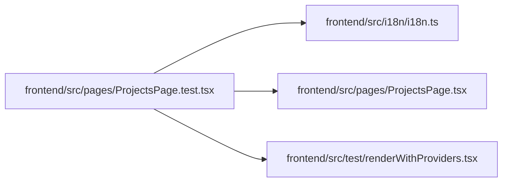

# ProjectsPage.test Module

**Path:** `frontend/src/pages/ProjectsPage.test.tsx`

## Description

_Auto-generated from `frontend/src/pages/ProjectsPage.test.tsx`._

## Imports

| Source | Symbols |
|--------|---------|
| `../i18n/i18n` | `i18n` |
| `../test/renderWithProviders` | `renderWithProviders` |
| `./ProjectsPage` | `ProjectsPage` |
| `@testing-library/react` | `screen`, `within` |
| `vitest` | `beforeEach`, `describe`, `expect`, `it`, `vi` |

## Module Signals

| Signal | Values |
|--------|--------|
| Constants | `projectServiceMock`, `savedViewServiceMock`, `project` |
| Module calls | `projectServiceMock = hoisted`, `savedViewServiceMock = hoisted`, `mock`, `mock`, `describe` |

## Local dependency map

<!-- Auto-generated local dependency summary. Do not edit by hand. -->

### Internal neighbors

| Direction | Module |
|---|---|
| Outbound | [i18n](../modules/i18n.md) |
| Outbound | [ProjectsPage](../modules/ProjectsPage.md) |
| Outbound | [renderWithProviders](../modules/renderWithProviders.md) |

### External packages

| Language | Used packages | Undeclared packages |
|---|---:|---:|
| typescript | 2 | 0 |
