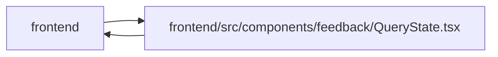

# QueryState Module

**Path:** `frontend/src/components/feedback/QueryState.tsx`

## Description

_Auto-generated from `frontend/src/components/feedback/QueryState.tsx`._

## Imports

| Source | Symbols |
|--------|---------|
| `../../utils/apiError` | `getApiErrorMessage` |
| `../common/Button` | `Button` |
| `lucide-react` | `AlertTriangle`, `Inbox`, `LoaderCircle`, `RefreshCw` |
| `react` | `Ref` |
| `react-i18next` | `useTranslation` |

## Module Signals

| Signal | Values |
|--------|--------|
| Exports | `QueryEmptyState`, `QueryErrorState`, `QueryLoadingState`, `QueryStaleState` |

## Local dependency map

<!-- Auto-generated local dependency summary. Do not edit by hand. -->

> Module-level dependencies exceed the generated-diagram limits, so the diagram and table below group them by top-level package. Counts report the number of module neighbors in each package.

### Internal neighbors

| Direction | Module |
|---|---|
| Inbound | `frontend` (65) |
| Outbound | `frontend` (2) |

### External packages

| Language | Used packages | Undeclared packages |
|---|---:|---:|
| typescript | 3 | 0 |

> All 67 module neighbor(s) are summarized by package because the module-level view exceeds the 12-node limit.

## Classes

| Class | Kind | Line | Bases / Target | Description |
|-------|------|------|----------------|-------------|
| [SharedStateProps](../entities/SharedStateProps.md) | Class | 7 | — | — |
| [QueryLoadingStateProps](../entities/QueryLoadingStateProps.md) | Class | 11 | `SharedStateProps` | — |
| [QueryErrorStateProps](../entities/QueryErrorStateProps.md) | Class | 15 | `SharedStateProps` | — |
| [QueryEmptyStateProps](../entities/QueryEmptyStateProps.md) | Class | 27 | `SharedStateProps` | — |
| [QueryStaleStateProps](../entities/QueryStaleStateProps.md) | Class | 32 | `SharedStateProps` | — |

## Functions

| Function | Signature | Decorators | Description |
|----------|-----------|------------|-------------|
| `QueryLoadingState` | `({ message, className = '' }: QueryLoadingStateProps)` | — | — |
| `QueryErrorState` | `({     error,     fallback,     headingLevel,     isRetrying = false,     message,     onRetry,     retryButtonRef,     retryLabel,     title,     className = '', }: QueryErrorStateProps)` | — | — |
| `QueryEmptyState` | `({ title, description, className = '' }: QueryEmptyStateProps)` | — | — |
| `QueryStaleState` | `({ message, onRetry, className = '' }: QueryStaleStateProps)` | — | — |
