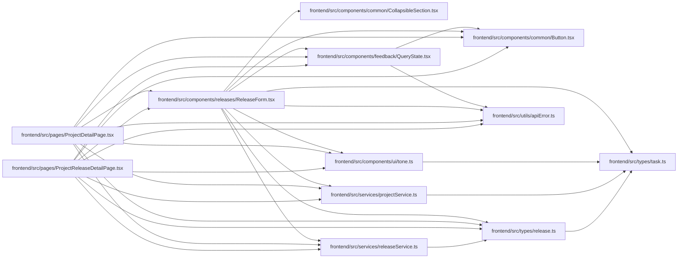

# ReleaseForm Module

**Path:** `frontend/src/components/releases/ReleaseForm.tsx`

## Description

_Auto-generated from `frontend/src/components/releases/ReleaseForm.tsx`._

## Imports

| Source | Symbols |
|--------|---------|
| `../../services/projectService` | `projectService` |
| `../../services/releaseService` | `releaseService` |
| `../../types/release` | `Release`, `ReleaseCreateRequest`, `ReleaseStatus`, `ReleaseUpdateRequest` |
| `../../types/task` | `Task` |
| `../../utils/apiError` | `getApiErrorMessage` |
| `../common/Button` | `Button` |
| `../common/CollapsibleSection` | `CollapsibleSection` |
| `../feedback/QueryState` | `QueryErrorState` |
| `../ui/tone` | `pillToneClassName`, `STATUS_TONE` |
| `@tanstack/react-query` | `useMutation`, `useQuery`, `useQueryClient` |
| `clsx` | `clsx` |
| `lucide-react` | `Save` |
| `react` | `useMemo`, `useState`, `FormEvent` |
| `react-i18next` | `useTranslation` |

## Module Signals

| Signal | Values |
|--------|--------|
| Exports | `ReleaseForm` |
| Constants | `releaseStatusOptions`, `textInputClassName` |

## Local dependency map

<!-- Auto-generated local dependency summary. Do not edit by hand. -->

### Internal neighbors

| Direction | Module |
|---|---|
| Inbound | [ProjectDetailPage](../modules/ProjectDetailPage.md) |
| Inbound | [ProjectReleaseDetailPage](../modules/ProjectReleaseDetailPage.md) |
| Outbound | [Button](../modules/Button.md) |
| Outbound | [CollapsibleSection](../modules/CollapsibleSection.md) |
| Outbound | [QueryState](../modules/QueryState.md) |
| Outbound | [tone](../modules/tone.md) |
| Outbound | [projectService](../modules/projectService.md) |
| Outbound | [releaseService](../modules/releaseService.md) |
| Outbound | [types_release](../modules/types_release.md) |
| Outbound | [types_task](../modules/types_task.md) |
| Outbound | [apiError](../modules/apiError.md) |

### External packages

| Language | Used packages | Undeclared packages |
|---|---:|---:|
| typescript | 5 | 0 |

## Classes

| Class | Kind | Line | Bases / Target | Description |
|-------|------|------|----------------|-------------|
| [ReleaseFormProps](../entities/ReleaseFormProps.md) | Class | 22 | — | — |
| [FlattenedTask](../entities/ReleaseForm_FlattenedTask.md) | Type alias | 29 | — | — |
| [ReleaseFormState](../entities/ReleaseFormState.md) | Type alias | 34 | — | — |

## Functions

| Function | Signature | Decorators | Description |
|----------|-----------|------------|-------------|
| `ReleaseForm` | `({     projectId,     initialData,     onSuccess,     onCancel, }: ReleaseFormProps)` | — | — |
