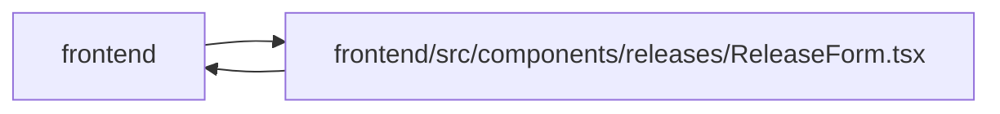

# ReleaseForm Module

**Path:** `frontend/src/components/releases/ReleaseForm.tsx`

## Description

_Auto-generated from `frontend/src/components/releases/ReleaseForm.tsx`._

## Imports

| Source | Symbols | Type-only | Runtime emission |
|--------|---------|-----------|------------------|
| `../../features/mutationFeedback` | `MutationFeedbackMeta` | Declaration | erased |
| `../../features/mutationFeedback` | `feedbackMessage` | — | compiler-dependent |
| `../../services/projectService` | `projectService` | — | compiler-dependent |
| `../../services/releaseService` | `releaseService` | — | compiler-dependent |
| `../../types/release` | `Release`, `ReleaseCreateRequest`, `ReleaseStatus`, `ReleaseUpdateRequest` | Declaration | erased |
| `../../types/task` | `Task` | Declaration | erased |
| `../../utils/apiError` | `getApiErrorMessage` | — | compiler-dependent |
| `../common/Button` | `Button` | — | compiler-dependent |
| `../common/CollapsibleSection` | `CollapsibleSection` | — | compiler-dependent |
| `../feedback/QueryState` | `QueryErrorState` | — | compiler-dependent |
| `../ui/tone` | `pillToneClassName`, `STATUS_TONE` | — | compiler-dependent |
| `@tanstack/react-query` | `useMutation`, `useQuery`, `useQueryClient` | — | compiler-dependent |
| `clsx` | `clsx` | — | compiler-dependent |
| `lucide-react` | `Save` | — | compiler-dependent |
| `react` | `FormEvent` | Declaration | erased |
| `react` | `useMemo`, `useState` | — | compiler-dependent |
| `react-i18next` | `useTranslation` | — | compiler-dependent |

## Module Signals

| Signal | Values |
|--------|--------|
| Exports | `ReleaseForm` |
| Constants | `releaseStatusOptions`, `textInputClassName` |

## Local dependency map

<!-- Auto-generated local dependency summary. Do not edit by hand. -->
This graph shows full source coupling. Type dependencies can be erased; compiler-dependent cycle groups are runtime candidates, not confirmed initialization cycles.

```mermaid
flowchart LR
    n0["frontend"]
    n1["frontend/src/components/releases/ReleaseForm.tsx"]
    n0 --> n1
    n1 --> n0
    click n1 "../modules/ReleaseForm.md"
```

> Module-level dependencies exceed the generated-diagram limits, so the diagram and table below group them by top-level package. Counts report the number of module neighbors in each package.

### Internal neighbors

| Direction | Module |
|---|---|
| Inbound | `frontend` (2) |
| Outbound | `frontend` (10) |

### External packages

| Language | Used packages | Undeclared packages |
|---|---:|---:|
| typescript | 5 | 0 |

> All 12 module neighbor(s) are summarized by package because the module-level view exceeds the 12-node limit.

## Classes

| Class | Kind | Line | Bases / Target | Description |
|-------|------|------|----------------|-------------|
| [ReleaseFormProps](../entities/ReleaseFormProps.md) | Interface | 24 | — | — |
| [FlattenedTask](../entities/ReleaseForm_FlattenedTask.md) | Type alias | 31 | <pre><code>&#123;&#10;    task&#58; Task&#59;&#10;    level&#58; number&#59;&#10;&#125;</code></pre> | — |
| [ReleaseFormState](../entities/ReleaseFormState.md) | Type alias | 36 | <pre><code>&#123;&#10;    name&#58; string&#59;&#10;    description&#58; string&#59;&#10;    status&#58; ReleaseStatus&#59;&#10;    target&#95;date&#58; string&#59;&#10;    shipped&#95;at&#58; string&#59;&#10;    version&#58; string&#59;&#10;    environment&#58; string&#59;&#10;    task&#95;ids&#58; number&#91;&#93;&#59;&#10;&#125;</code></pre> | — |

## Functions

| Function | Signature | Decorators | Description |
|----------|-----------|------------|-------------|
| `ReleaseForm` | <pre><code>&#40;&#123;&#10;    projectId&#44;&#10;    initialData&#44;&#10;    onSuccess&#44;&#10;    onCancel&#44;&#10;&#125;&#58; ReleaseFormProps&#41;</code></pre> | — | — |
