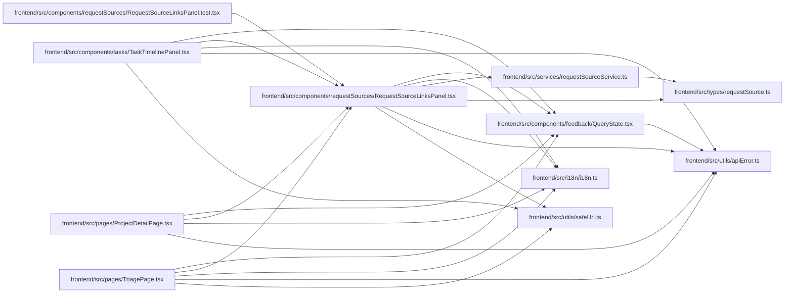

# RequestSourceLinksPanel Module

**Path:** `frontend/src/components/requestSources/RequestSourceLinksPanel.tsx`

## Description

_Auto-generated from `frontend/src/components/requestSources/RequestSourceLinksPanel.tsx`._

## Imports

| Source | Symbols |
|--------|---------|
| `../../i18n/i18n` | `i18n` |
| `../../services/requestSourceService` | `requestSourceService` |
| `../../types/requestSource` | `RequestSource`, `RequestSourceLinkCreate`, `RequestSourceTargetType`, `RequestSourceType` |
| `../../utils/apiError` | `getApiErrorMessage` |
| `../../utils/safeUrl` | `safeExternalHref` |
| `../feedback/QueryState` | `QueryErrorState`, `QueryLoadingState` |
| `@tanstack/react-query` | `useMutation`, `useQuery`, `useQueryClient` |
| `clsx` | `clsx` |
| `lucide-react` | `AlertCircle`, `Link2`, `Loader2`, `Plus`, `Search`, `Trash2`, `X` |
| `react` | `useMemo`, `useState`, `KeyboardEvent` |

## Module Signals

| Signal | Values |
|--------|--------|
| Exports | `RequestSourceLinksPanel` |
| Constants | `t`, `sourceTypeOptions` |
| Module calls | `t = bind` |

## Local dependency map

<!-- Auto-generated local dependency summary. Do not edit by hand. -->

### Internal neighbors

| Direction | Module |
|---|---|
| Inbound | [RequestSourceLinksPanel.test](../modules/RequestSourceLinksPanel.test.md) |
| Inbound | [TaskTimelinePanel](../modules/TaskTimelinePanel.md) |
| Inbound | [ProjectDetailPage](../modules/ProjectDetailPage.md) |
| Inbound | [TriagePage](../modules/TriagePage.md) |
| Outbound | [QueryState](../modules/QueryState.md) |
| Outbound | [i18n](../modules/i18n.md) |
| Outbound | [requestSourceService](../modules/requestSourceService.md) |
| Outbound | [requestSource](../modules/requestSource.md) |
| Outbound | [apiError](../modules/apiError.md) |
| Outbound | [safeUrl](../modules/safeUrl.md) |

### External packages

| Language | Used packages | Undeclared packages |
|---|---:|---:|
| typescript | 4 | 0 |

## Classes

| Class | Kind | Line | Bases / Target | Description |
|-------|------|------|----------------|-------------|
| [RequestSourceLinksPanelProps](../entities/RequestSourceLinksPanelProps.md) | Class | 19 | — | — |

## Functions

| Function | Signature | Decorators | Description |
|----------|-----------|------------|-------------|
| `RequestSourceLinksPanel` | `({     targetType,     targetId,     initialCount = 0,     title,     compact = false,     onChanged, }: RequestSourceLinksPanelProps)` | — | — |
