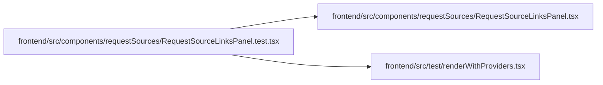

# RequestSourceLinksPanel.test Module

**Path:** `frontend/src/components/requestSources/RequestSourceLinksPanel.test.tsx`

## Description

_Auto-generated from `frontend/src/components/requestSources/RequestSourceLinksPanel.test.tsx`._

## Imports

| Source | Symbols |
|--------|---------|
| `../../test/renderWithProviders` | `renderWithProviders` |
| `./RequestSourceLinksPanel` | `RequestSourceLinksPanel` |
| `@testing-library/react` | `screen`, `waitFor` |
| `react` | `FormEvent` |
| `vitest` | `beforeEach`, `describe`, `expect`, `it`, `vi` |

## Module Signals

| Signal | Values |
|--------|--------|
| Constants | `requestSourceServiceMock` |
| Module calls | `requestSourceServiceMock = hoisted`, `mock`, `describe` |

## Local dependency map

<!-- Auto-generated local dependency summary. Do not edit by hand. -->

### Internal neighbors

| Direction | Module |
|---|---|
| Outbound | [RequestSourceLinksPanel](../modules/RequestSourceLinksPanel.md) |
| Outbound | [renderWithProviders](../modules/renderWithProviders.md) |

### External packages

| Language | Used packages | Undeclared packages |
|---|---:|---:|
| typescript | 3 | 0 |
