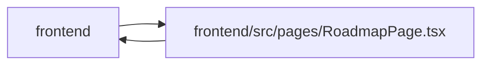

# RoadmapPage Module

**Path:** `frontend/src/pages/RoadmapPage.tsx`

## Description

Milestone continuation is explicit and uses the bounded live window. Reaching the end of a retired window does not establish complete portfolio milestone data; existing date-range and loaded-marker recovery remain visible.

## Imports

| Source | Symbols |
|--------|---------|
| `../components/common/Button` | `Button` |
| `../components/feedback/LiveWindowStatus` | `LiveWindowStatus` |
| `../components/feedback/QueryState` | `QueryErrorState`, `QueryStaleState` |
| `../components/planning/PlanningWorkbenchFrame` | `PlanningWorkbenchFrame` |
| `../components/projects/projectStatusStyles` | `projectStatusBadgeClassName` |
| `../components/ui` | `FormGrid`, `InlineEmptyState`, `InlineField`, `SlideOverDrawer` |
| `../features/useLiveWindow` | `useLiveWindow` |
| `../i18n/dateLocale` | `dateFnsLocale` |
| `../i18n/i18n` | `i18n` |
| `../services/projectService` | `projectService` |
| `../types/project` | `Initiative`, `Project`, `ProjectHealth`, `ProjectMilestone`, `ProjectMilestoneStatus`, `ProjectStatus` |
| `../utils/formatDate` | `formatDate` |
| `../utils/teamMemberLabels` | `formatPortfolioOwnerLabel` |
| `@tanstack/react-query` | `useQuery` |
| `clsx` | `clsx` |
| `date-fns` | `addDays`, `compareAsc`, `differenceInCalendarDays`, `eachMonthOfInterval`, `format`, `parseISO`, `startOfMonth` |
| `lucide-react` | `FolderOpen`, `ListFilter`, `Map`, `RotateCcw`, `X` |
| `react` | `useId`, `useMemo`, `useState` |
| `react-i18next` | `useTranslation` |
| `react-router-dom` | `Link` |

## Module Signals

| Signal | Values |
|--------|--------|
| Exports | `default` |
| Constants | `t`, `projectStatusLabelKeys`, `projectHealthLabelKeys`, `milestoneStatusLabelKeys` |
| Module calls | `t = bind` |

## Local dependency map

<!-- Auto-generated local dependency summary. Do not edit by hand. -->

> Module-level dependencies exceed the generated-diagram limits, so the diagram and table below group them by top-level package. Counts report the number of module neighbors in each package.

### Internal neighbors

| Direction | Module |
|---|---|
| Inbound | `frontend` (1) |
| Outbound | `frontend` (13) |

### External packages

| Language | Used packages | Undeclared packages |
|---|---:|---:|
| typescript | 7 | 0 |

> All 14 module neighbor(s) are summarized by package because the module-level view exceeds the 12-node limit.

## Classes

| Class | Kind | Line | Bases / Target | Description |
|-------|------|------|----------------|-------------|
| [RoadmapMarker](../entities/RoadmapMarker.md) | Type alias | 43 | — | — |
| [RoadmapRow](../entities/RoadmapRow.md) | Type alias | 48 | — | — |
| [DateRange](../entities/DateRange.md) | Type alias | 58 | — | — |
| [InitiativeGroupInfo](../entities/InitiativeGroupInfo.md) | Type alias | 63 | — | — |
| [RoadmapGroup](../entities/RoadmapGroup.md) | Type alias | 68 | — | — |
| [RoadmapFilterDescriptor](../entities/RoadmapFilterDescriptor.md) | Type alias | 74 | — | — |
