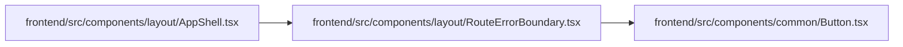

# RouteErrorBoundary Module

**Path:** `frontend/src/components/layout/RouteErrorBoundary.tsx`

## Description

_Auto-generated from `frontend/src/components/layout/RouteErrorBoundary.tsx`._

## Imports

| Source | Symbols |
|--------|---------|
| `../common/Button` | `Button` |
| `lucide-react` | `AlertTriangle`, `Home`, `RefreshCw` |
| `react` | `Component`, `ErrorInfo`, `ReactNode` |

## Module Signals

| Signal | Values |
|--------|--------|
| Exports | `RouteErrorBoundary` |

## Local dependency map

<!-- Auto-generated local dependency summary. Do not edit by hand. -->

### Internal neighbors

| Direction | Module |
|---|---|
| Inbound | [AppShell](../modules/AppShell.md) |
| Outbound | [Button](../modules/Button.md) |

### External packages

| Language | Used packages | Undeclared packages |
|---|---:|---:|
| typescript | 2 | 0 |

## Classes

| Class | Kind | Line | Bases / Target | Description |
|-------|------|------|----------------|-------------|
| [RouteErrorBoundary](../entities/RouteErrorBoundary.md) | Class | 18 | `Component` | — |
| [RouteErrorBoundaryProps](../entities/RouteErrorBoundaryProps.md) | Class | 5 | — | — |
| [RouteErrorBoundaryState](../entities/RouteErrorBoundaryState.md) | Class | 14 | — | — |
