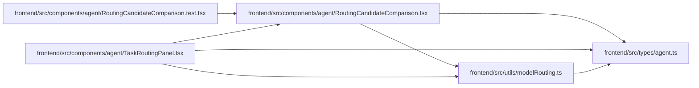

# RoutingCandidateComparison Module

**Path:** `frontend/src/components/agent/RoutingCandidateComparison.tsx`

## Description

_Auto-generated from `frontend/src/components/agent/RoutingCandidateComparison.tsx`._

## Imports

| Source | Symbols |
|--------|---------|
| `../../types/agent` | `AgentActorRosterItem`, `AgentRoutingCandidate`, `AgentRoutingExclusion`, `AgentRoutingPreviewResponse` |
| `../../utils/modelRouting` | `formatRoutingCode` |
| `lucide-react` | `CheckCircle2`, `ShieldX` |
| `react-i18next` | `useTranslation` |

## Module Signals

| Signal | Values |
|--------|--------|
| Exports | `RoutingCandidateComparison` |

## Local dependency map

<!-- Auto-generated local dependency summary. Do not edit by hand. -->

### Internal neighbors

| Direction | Module |
|---|---|
| Inbound | [RoutingCandidateComparison.test](../modules/RoutingCandidateComparison.test.md) |
| Inbound | [TaskRoutingPanel](../modules/TaskRoutingPanel.md) |
| Outbound | [types_agent](../modules/types_agent.md) |
| Outbound | [modelRouting](../modules/modelRouting.md) |

### External packages

| Language | Used packages | Undeclared packages |
|---|---:|---:|
| typescript | 2 | 0 |

## Classes

| Class | Kind | Line | Bases / Target | Description |
|-------|------|------|----------------|-------------|
| [RoutingCandidateComparisonProps](../entities/RoutingCandidateComparisonProps.md) | Class | 15 | — | — |

## Functions

| Function | Signature | Decorators | Description |
|----------|-----------|------------|-------------|
| `RoutingCandidateComparison` | `({     preview,     roster,     selectedCandidateKey,     onSelectCandidate,     selectionDisabled = false, }: RoutingCandidateComparisonProps)` | — | — |
