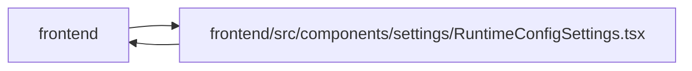

# RuntimeConfigSettings Module

**Path:** `frontend/src/components/settings/RuntimeConfigSettings.tsx`

## Description

_Auto-generated from `frontend/src/components/settings/RuntimeConfigSettings.tsx`._

## Imports

| Source | Symbols |
|--------|---------|
| `../../hooks/useAdminAccess` | `useAdminAccess` |
| `../../services/systemSettingsService` | `systemSettingsService` |
| `../../types/systemSettings` | `AILanguageMode`, `AppRuntimeSettingsUpdate`, `GitHubRuntimeSettingsUpdate`, `LLMProvider`, `LLMRuntimeSettingsUpdate`, `RuntimeSettingSource`, `SystemSettings`, `WebIntakeRuntimeSettingsUpdate` |
| `../../utils/adminAccess` | `getAdminAccessErrorMessage` |
| `../../utils/protectedQueries` | `protectedQueryRetry` |
| `../common/Button` | `Button` |
| `../common/Checkbox` | `Checkbox` |
| `../common/Input` | `Input` |
| `../feedback/QueryState` | `QueryEmptyState`, `QueryErrorState`, `QueryLoadingState` |
| `../feedback/toast` | `useToast` |
| `@tanstack/react-query` | `useMutation`, `useQuery`, `useQueryClient` |
| `lucide-react` | `Globe2`, `KeyRound`, `RefreshCcw`, `Save`, `ServerCog`, `ShieldAlert` |
| `react` | `useState` |
| `react-i18next` | `useTranslation` |

## Module Signals

| Signal | Values |
|--------|--------|
| Exports | `RuntimeConfigSettings` |
| Constants | `DEFAULT_LLM_ENDPOINTS`, `sourceClass` |

## Local dependency map

<!-- Auto-generated local dependency summary. Do not edit by hand. -->

> Module-level dependencies exceed the generated-diagram limits, so the diagram and table below group them by top-level package. Counts report the number of module neighbors in each package.

### Internal neighbors

| Direction | Module |
|---|---|
| Inbound | `frontend` (2) |
| Outbound | `frontend` (10) |

### External packages

| Language | Used packages | Undeclared packages |
|---|---:|---:|
| typescript | 4 | 0 |

> All 12 module neighbor(s) are summarized by package because the module-level view exceeds the 12-node limit.

## Classes

| Class | Kind | Line | Bases / Target | Description |
|-------|------|------|----------------|-------------|
| [LLMForm](../entities/LLMForm.md) | Class | 25 | — | — |
| [AppForm](../entities/AppForm.md) | Class | 35 | — | — |
| [GitHubForm](../entities/GitHubForm.md) | Class | 39 | — | — |
| [WebIntakeForm](../entities/WebIntakeForm.md) | Class | 49 | — | — |
| [RuntimeSection](../entities/RuntimeSection.md) | Type alias | 55 | — | — |
| [RuntimeErrors](../entities/RuntimeErrors.md) | Type alias | 56 | — | — |

## Functions

| Function | Signature | Decorators | Description |
|----------|-----------|------------|-------------|
| `RuntimeConfigSettings` | `()` | — | — |
