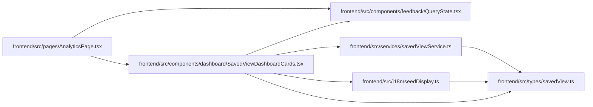

# SavedViewDashboardCards Module

**Path:** `frontend/src/components/dashboard/SavedViewDashboardCards.tsx`

## Description

_Auto-generated from `frontend/src/components/dashboard/SavedViewDashboardCards.tsx`._

## Imports

| Source | Symbols |
|--------|---------|
| `../../i18n/seedDisplay` | `savedViewDisplay` |
| `../../services/savedViewService` | `savedViewService` |
| `../../types/savedView` | `SavedViewDashboardCard`, `SavedViewType` |
| `../feedback/QueryState` | `QueryEmptyState`, `QueryErrorState`, `QueryLoadingState` |
| `@tanstack/react-query` | `useQuery` |
| `clsx` | `clsx` |
| `lucide-react` | `AlertTriangle`, `ArrowRight`, `Bookmark`, `FolderOpen`, `Inbox`, `ListTodo` |
| `react-i18next` | `useTranslation` |
| `react-router-dom` | `Link` |

## Module Signals

| Signal | Values |
|--------|--------|
| Exports | `SavedViewDashboardCards` |
| Constants | `viewTypeLabelKeys`, `viewTypeIcons`, `viewTypeTone` |

## Local dependency map

<!-- Auto-generated local dependency summary. Do not edit by hand. -->

### Internal neighbors

| Direction | Module |
|---|---|
| Inbound | [AnalyticsPage](../modules/AnalyticsPage.md) |
| Outbound | [QueryState](../modules/QueryState.md) |
| Outbound | [seedDisplay](../modules/seedDisplay.md) |
| Outbound | [savedViewService](../modules/savedViewService.md) |
| Outbound | [savedView](../modules/savedView.md) |

### External packages

| Language | Used packages | Undeclared packages |
|---|---:|---:|
| typescript | 5 | 0 |

## Classes

| Class | Kind | Line | Bases / Target | Description |
|-------|------|------|----------------|-------------|
| [SavedViewDashboardCardsProps](../entities/SavedViewDashboardCardsProps.md) | Class | 11 | — | — |

## Functions

| Function | Signature | Decorators | Description |
|----------|-----------|------------|-------------|
| `SavedViewDashboardCards` | `({     iterationId,     title,     className, }: SavedViewDashboardCardsProps)` | — | — |
