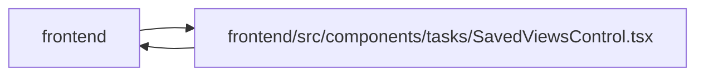

# SavedViewsControl Module

**Path:** `frontend/src/components/tasks/SavedViewsControl.tsx`

## Description

Preserves authenticated saved-view ownership and legacy predicate adaptation. It distinguishes local modifications from saved filters and provides Save changes, Save as and reset controls. Unsaved filters are explicitly local; reloading follows the saved or linked view.

## Imports

| Source | Symbols |
|--------|---------|
| `../../i18n/i18n` | `i18n` |
| `../../i18n/seedDisplay` | `savedViewDisplay` |
| `../../services/savedViewService` | `savedViewService` |
| `../../services/sessionService` | `sessionService` |
| `../../types/savedView` | `SavedView`, `SavedViewScope` |
| `../../utils/apiError` | `getApiErrorMessage` |
| `../../utils/savedViewState` | `savedViewModified` |
| `../common/Button` | `Button` |
| `../common/Input` | `Input` |
| `../common/Modal` | `Modal` |
| `../common/useConfirmDialog` | `useConfirmDialog` |
| `../feedback/QueryState` | `QueryErrorState` |
| `./TaskFiltersBar` | `TaskFilters` |
| `./TaskList` | `SortKey` |
| `@tanstack/react-query` | `useMutation`, `useQuery`, `useQueryClient` |
| `lucide-react` | `AlertTriangle`, `Copy`, `Save`, `Trash2` |
| `react` | `useMemo`, `useRef`, `useState`, `FormEvent` |

## Module Signals

| Signal | Values |
|--------|--------|
| Exports | `SavedViewsControl` |
| Constants | `t` |
| Module calls | `t = bind` |

## Local dependency map

<!-- Auto-generated local dependency summary. Do not edit by hand. -->

> Module-level dependencies exceed the generated-diagram limits, so the diagram and table below group them by top-level package. Counts report the number of module neighbors in each package.

### Internal neighbors

| Direction | Module |
|---|---|
| Inbound | `frontend` (1) |
| Outbound | `frontend` (14) |

### External packages

| Language | Used packages | Undeclared packages |
|---|---:|---:|
| typescript | 3 | 0 |

> All 15 module neighbor(s) are summarized by package because the module-level view exceeds the 12-node limit.

## Classes

| Class | Kind | Line | Bases / Target | Description |
|-------|------|------|----------------|-------------|
| [SavedViewsControlProps](../entities/SavedViewsControlProps.md) | Class | 25 | — | — |
| [EditableScope](../entities/EditableScope.md) | Type alias | 22 | — | — |
| [FormMode](../entities/FormMode.md) | Type alias | 23 | — | — |

## Functions

| Function | Signature | Decorators | Description |
|----------|-----------|------------|-------------|
| `SavedViewsControl` | `({     filters,     sortKey,     selectedViewId,     onSelectedViewIdChange,     onApplyView, }: SavedViewsControlProps)` | — | — |
