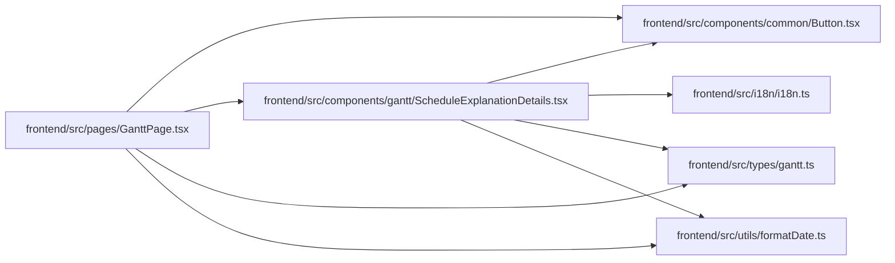

# ScheduleExplanationDetails Module

**Path:** `frontend/src/components/gantt/ScheduleExplanationDetails.tsx`

## Description

_Auto-generated from `frontend/src/components/gantt/ScheduleExplanationDetails.tsx`._

## Imports

| Source | Symbols |
|--------|---------|
| `../../i18n/i18n` | `i18n` |
| `../../types/gantt` | `GanttTask`, `ScheduleDecisionExplanation` |
| `../../utils/formatDate` | `formatDate` |
| `../common/Button` | `Button` |
| `clsx` | `clsx` |
| `date-fns` | `addDays`, `format`, `parseISO` |
| `lucide-react` | `AlertTriangle`, `ChevronDown`, `ChevronRight`, `ExternalLink` |
| `react` | `useState` |

## Module Signals

| Signal | Values |
|--------|--------|
| Exports | `ScheduleExplanationDetails` |
| Constants | `t`, `DECISION_BADGE_CLASSES` |
| Module calls | `t = bind` |

## Local dependency map

<!-- Auto-generated local dependency summary. Do not edit by hand. -->

### Internal neighbors

| Direction | Module |
|---|---|
| Inbound | [GanttPage](../modules/GanttPage.md) |
| Outbound | [Button](../modules/Button.md) |
| Outbound | [i18n](../modules/i18n.md) |
| Outbound | [types_gantt](../modules/types_gantt.md) |
| Outbound | [formatDate](../modules/formatDate.md) |

### External packages

| Language | Used packages | Undeclared packages |
|---|---:|---:|
| typescript | 4 | 0 |

## Classes

| Class | Kind | Line | Bases / Target | Description |
|-------|------|------|----------------|-------------|
| [ScheduleExplanationDetailsProps](../entities/ScheduleExplanationDetailsProps.md) | Class | 12 | — | — |

## Functions

| Function | Signature | Decorators | Description |
|----------|-----------|------------|-------------|
| `ScheduleExplanationDetails` | `({     decisions,     taskLookup,     memberVacations,     workloadBalanced,     workloadIssues,     onOpenTask, }: ScheduleExplanationDetailsProps)` | — | — |
