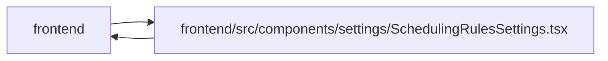

# SchedulingRulesSettings Module

**Path:** `frontend/src/components/settings/SchedulingRulesSettings.tsx`

## Description

_Auto-generated from `frontend/src/components/settings/SchedulingRulesSettings.tsx`._

## Imports

| Source | Symbols |
|--------|---------|
| `../../hooks/useAdminAccess` | `useAdminAccess` |
| `../../services/schedulingRulesService` | `schedulingRulesService` |
| `../../types/schedulingRules` | `SchedulingRules`, `EffortModifier`, `SchedulingPass`, `Constraints` |
| `../../utils/adminAccess` | `getAdminAccessErrorMessage` |
| `../../utils/protectedQueries` | `protectedQueryRetry` |
| `../common/Button` | `Button` |
| `../common/useConfirmDialog` | `useConfirmDialog` |
| `../feedback/QueryState` | `QueryErrorState` |
| `../feedback/toast` | `useToast` |
| `./ConstraintsPanel` | `ConstraintsPanel` |
| `./EffortModifierCard` | `EffortModifierCard` |
| `./SchedulingPassCard` | `SchedulingPassCard` |
| `@dnd-kit/core` | `DndContext`, `closestCenter`, `KeyboardSensor`, `PointerSensor`, `useSensor`, `useSensors`, `DragEndEvent` |
| `@dnd-kit/sortable` | `arrayMove`, `SortableContext`, `sortableKeyboardCoordinates`, `verticalListSortingStrategy` |
| `@tanstack/react-query` | `useQuery`, `useMutation`, `useQueryClient` |
| `lucide-react` | `AlertTriangle`, `Save`, `RotateCcw`, `ChevronDown`, `ChevronRight`, `Plus`, `Loader2` |
| `react` | `useState`, `useCallback`, `useMemo` |
| `react-i18next` | `useTranslation` |

## Module Signals

| Signal | Values |
|--------|--------|
| Exports | `SchedulingRulesSettings` |
| Constants | `SETTINGS_ROW_ID` |
| Module calls | `SETTINGS_ROW_ID = Symbol` |

## Local dependency map

<!-- Auto-generated local dependency summary. Do not edit by hand. -->

> Module-level dependencies exceed the generated-diagram limits, so the diagram and table below group them by top-level package. Counts report the number of module neighbors in each package.

### Internal neighbors

| Direction | Module |
|---|---|
| Inbound | `frontend` (2) |
| Outbound | `frontend` (12) |

### External packages

| Language | Used packages | Undeclared packages |
|---|---:|---:|
| typescript | 6 | 0 |

> All 14 module neighbor(s) are summarized by package because the module-level view exceeds the 12-node limit.

## Classes

| Class | Kind | Line | Bases / Target | Description |
|-------|------|------|----------------|-------------|
| [SectionId](../entities/SectionId.md) | Type alias | 33 | — | — |
| [SettingsRowIdentity](../entities/SettingsRowIdentity.md) | Type alias | 36 | — | — |
| [EditableEffortModifier](../entities/EditableEffortModifier.md) | Type alias | 37 | — | — |
| [EditableSchedulingPass](../entities/EditableSchedulingPass.md) | Type alias | 38 | — | — |
| [EditableSchedulingRules](../entities/EditableSchedulingRules.md) | Type alias | 39 | — | — |

## Functions

| Function | Signature | Decorators | Description |
|----------|-----------|------------|-------------|
| `SchedulingRulesSettings` | `()` | — | — |
