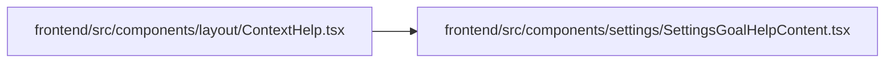

# SettingsGoalHelpContent Module

**Path:** `frontend/src/components/settings/SettingsGoalHelpContent.tsx`

## Description

_Auto-generated from `frontend/src/components/settings/SettingsGoalHelpContent.tsx`._

## Imports

| Source | Symbols |
|--------|---------|
| `lucide-react` | `ArrowRight` |
| `react-i18next` | `useTranslation` |
| `react-router-dom` | `Link`, `useSearchParams` |

## Module Signals

| Signal | Values |
|--------|--------|
| Exports | `SettingsGoalHelpContent` |

## Local dependency map

<!-- Auto-generated local dependency summary. Do not edit by hand. -->

### Internal neighbors

| Direction | Module |
|---|---|
| Inbound | [ContextHelp](../modules/ContextHelp.md) |

### External packages

| Language | Used packages | Undeclared packages |
|---|---:|---:|
| typescript | 3 | 0 |

## Classes

| Class | Kind | Line | Bases / Target | Description |
|-------|------|------|----------------|-------------|
| [SettingsGoalTab](../entities/SettingsGoalTab.md) | Type alias | 5 | — | — |

## Functions

| Function | Signature | Decorators | Description |
|----------|-----------|------------|-------------|
| `SettingsGoalHelpContent` | `({     onNavigate, }: {     onNavigate?: () => void; })` | — | — |
