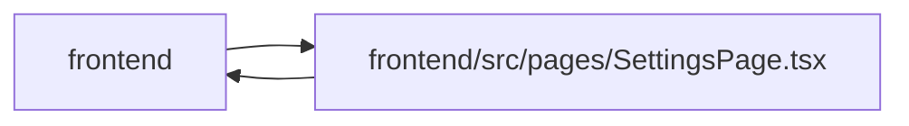

# SettingsPage Module

**Path:** `frontend/src/pages/SettingsPage.tsx`

## Description

_Auto-generated from `frontend/src/pages/SettingsPage.tsx`._

## Imports

| Source | Symbols |
|--------|---------|
| `../components/common/Checkbox` | `Checkbox` |
| `../components/settings/AdminAccessGate` | `AdminAccessGate` |
| `../components/settings/AdminAccessPanel` | `AdminAccessPanel` |
| `../components/settings/AgentAccessPanel` | `AgentAccessPanel` |
| `../components/settings/AgentModelAdministration` | `AgentModelAdministration` |
| `../components/settings/EmailSettingsPanel` | `EmailSettingsPanel` |
| `../components/settings/GitHubSettingsPanel` | `GitHubSettingsPanel` |
| `../components/settings/InterfaceLanguageSettings` | `InterfaceLanguageSettings` |
| `../components/settings/OutboundWebhooksPanel` | `OutboundWebhooksPanel` |
| `../components/settings/RuntimeConfigSettings` | `RuntimeConfigSettings` |
| `../components/settings/SchedulingRulesSettings` | `SchedulingRulesSettings` |
| `../components/settings/SystemHealthPanel` | `SystemHealthPanel` |
| `../components/settings/TemplateLabelSettings` | `TemplateLabelSettings` |
| `../components/ui` | `PageHeader`, `PageLayout` |
| `../hooks/useAdminAccess` | `useAdminAccess` |
| `../hooks/useSingleKeyShortcutPreference` | `useSingleKeyShortcutPreference` |
| `../store/themeStore` | `useThemeStore` |
| `lucide-react` | `Activity`, `AlertTriangle`, `ArrowRight`, `Bell`, `Bot`, `CalendarClock`, `Check`, `ChevronDown`, `Github`, `KeyRound`, `Keyboard`, `Palette`, `Search`, `ServerCog`, `Settings2`, `Tags`, `Webhook`, `LucideIcon` |
| `react` | `useEffect`, `useMemo`, `useState`, `KeyboardEvent` |
| `react-i18next` | `useTranslation` |
| `react-router-dom` | `Link`, `useSearchParams` |

## Module Signals

| Signal | Values |
|--------|--------|
| Exports | `RECENT_SETTINGS_STORAGE_KEY`, `default` |
| Constants | `SETTINGS_GROUPS`, `SETTINGS_DESTINATIONS`, `MAX_RECENT_SETTINGS`, `RECENT_SETTINGS_STORAGE_KEY` |
| Module calls | `SETTINGS_DESTINATIONS = flatMap` |

## Local dependency map

<!-- Auto-generated local dependency summary. Do not edit by hand. -->

> Module-level dependencies exceed the generated-diagram limits, so the diagram and table below group them by top-level package. Counts report the number of module neighbors in each package.

### Internal neighbors

| Direction | Module |
|---|---|
| Inbound | `frontend` (1) |
| Outbound | `frontend` (17) |

### External packages

| Language | Used packages | Undeclared packages |
|---|---:|---:|
| typescript | 4 | 0 |

> All 18 module neighbor(s) are summarized by package because the module-level view exceeds the 12-node limit.

## Classes

| Class | Kind | Line | Bases / Target | Description |
|-------|------|------|----------------|-------------|
| [SettingsDestination](../entities/SettingsDestination.md) | Class | 47 | — | — |
| [SettingsGroup](../entities/SettingsGroup.md) | Class | 59 | — | — |
| [SettingsTab](../entities/SettingsTab.md) | Type alias | 43 | — | — |
| [SettingsPageTab](../entities/SettingsPageTab.md) | Type alias | 44 | — | — |
| [SettingsGroupId](../entities/SettingsGroupId.md) | Type alias | 45 | — | — |
| [SettingsDestinationHeader](../entities/SettingsDestinationHeader.md) | Type alias | 54 | — | — |
