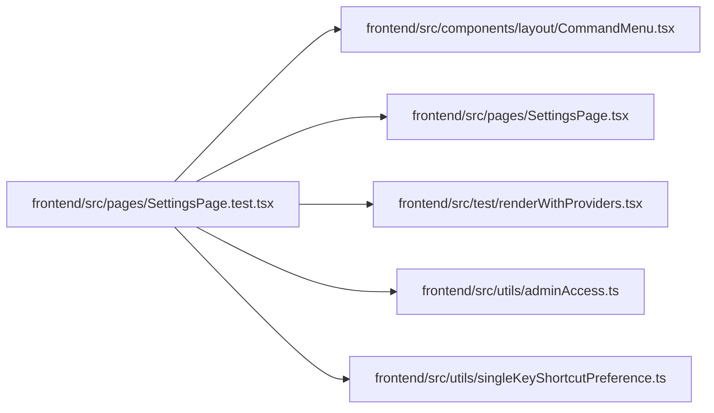

# SettingsPage.test Module

**Path:** `frontend/src/pages/SettingsPage.test.tsx`

## Description

_Auto-generated from `frontend/src/pages/SettingsPage.test.tsx`._

## Imports

| Source | Symbols |
|--------|---------|
| `../components/layout/CommandMenu` | `CommandMenu` |
| `../test/renderWithProviders` | `renderWithProviders` |
| `../utils/adminAccess` | `ADMIN_API_KEY_STORAGE_KEY` |
| `../utils/singleKeyShortcutPreference` | `SINGLE_KEY_SHORTCUTS_STORAGE_KEY` |
| `./SettingsPage` | `SettingsPage`, `RECENT_SETTINGS_STORAGE_KEY` |
| `@testing-library/react` | `screen`, `waitFor`, `within` |
| `react` | `ReactNode` |
| `vitest` | `beforeEach`, `describe`, `expect`, `it`, `vi` |

## Module Signals

| Signal | Values |
|--------|--------|
| Constants | `themeStoreMock` |
| Module calls | `themeStoreMock = hoisted`, `mock`, `mock`, `mock`, `describe` |

## Local dependency map

<!-- Auto-generated local dependency summary. Do not edit by hand. -->

### Internal neighbors

| Direction | Module |
|---|---|
| Outbound | [CommandMenu](../modules/CommandMenu.md) |
| Outbound | [SettingsPage](../modules/SettingsPage.md) |
| Outbound | [renderWithProviders](../modules/renderWithProviders.md) |
| Outbound | [adminAccess](../modules/adminAccess.md) |
| Outbound | [singleKeyShortcutPreference](../modules/singleKeyShortcutPreference.md) |

### External packages

| Language | Used packages | Undeclared packages |
|---|---:|---:|
| typescript | 3 | 0 |
