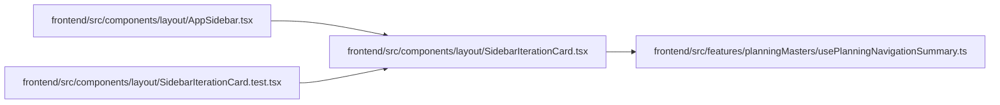

# SidebarIterationCard Module

**Path:** `frontend/src/components/layout/SidebarIterationCard.tsx`

## Description

_Auto-generated from `frontend/src/components/layout/SidebarIterationCard.tsx`._

## Imports

| Source | Symbols |
|--------|---------|
| `../../features/planningMasters/usePlanningNavigationSummary` | `usePlanningNavigationSummary` |
| `react` | `KeyboardEvent`, `useEffect`, `useId`, `useRef`, `useState` |
| `react-i18next` | `useTranslation` |
| `react-router-dom` | `Link` |

## Module Signals

| Signal | Values |
|--------|--------|
| Exports | `SidebarIterationCard` |

## Local dependency map

<!-- Auto-generated local dependency summary. Do not edit by hand. -->

### Internal neighbors

| Direction | Module |
|---|---|
| Inbound | [AppSidebar](../modules/AppSidebar.md) |
| Inbound | [SidebarIterationCard.test](../modules/SidebarIterationCard.test.md) |
| Outbound | [usePlanningNavigationSummary](../modules/usePlanningNavigationSummary.md) |

### External packages

| Language | Used packages | Undeclared packages |
|---|---:|---:|
| typescript | 3 | 0 |

## Functions

| Function | Signature | Decorators | Description |
|----------|-----------|------------|-------------|
| `SidebarIterationCard` | `({ onNavigate }: { onNavigate?: () => void })` | — | — |
