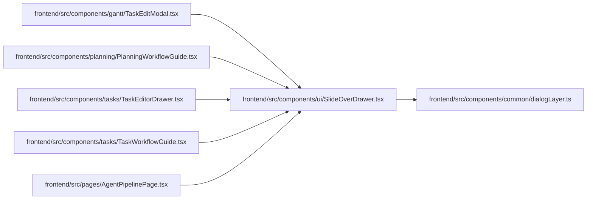

# SlideOverDrawer Module

**Path:** `frontend/src/components/ui/SlideOverDrawer.tsx`

## Description

_Auto-generated from `frontend/src/components/ui/SlideOverDrawer.tsx`._

## Imports

| Source | Symbols |
|--------|---------|
| `../common/dialogLayer` | `useDialogLayer` |
| `lucide-react` | `X` |
| `react` | `useId`, `ReactNode`, `RefObject` |
| `react-dom` | `createPortal` |
| `react-i18next` | `useTranslation` |
| `tailwind-merge` | `twMerge` |

## Module Signals

| Signal | Values |
|--------|--------|
| Exports | `SlideOverDrawer` |

## Local dependency map

<!-- Auto-generated local dependency summary. Do not edit by hand. -->

### Internal neighbors

| Direction | Module |
|---|---|
| Inbound | [TaskEditModal](../modules/TaskEditModal.md) |
| Inbound | [PlanningWorkflowGuide](../modules/PlanningWorkflowGuide.md) |
| Inbound | [TaskEditorDrawer](../modules/TaskEditorDrawer.md) |
| Inbound | [TaskWorkflowGuide](../modules/TaskWorkflowGuide.md) |
| Inbound | [AgentPipelinePage](../modules/AgentPipelinePage.md) |
| Outbound | [dialogLayer](../modules/dialogLayer.md) |

### External packages

| Language | Used packages | Undeclared packages |
|---|---:|---:|
| typescript | 5 | 0 |

## Functions

| Function | Signature | Decorators | Description |
|----------|-----------|------------|-------------|
| `SlideOverDrawer` | `({     open,     title,     subtitle,     icon,     children,     footer,     onClose,     ariaLabel,     className,     initialFocusRef,     restoreFocusRef,     closeOnBackdropClick = true,     closeDisabled = false,     closeLabel: closeLabelProp, }: {     open: boolean;     title: ReactNode;     subtitle?: ReactNode;     icon?: ReactNode;     children: ReactNode;     footer?: ReactNode;     onClose: () => void;     ariaLabel?: string;     className?: string;     initialFocusRef?: RefObject<HTMLElement \| null>;     restoreFocusRef?: RefObject<HTMLElement \| null>;     closeOnBackdropClick?: boolean;     closeDisabled?: boolean;     closeLabel?: string; })` | — | — |
