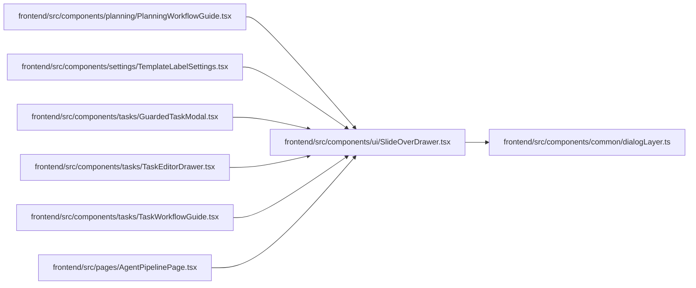

# SlideOverDrawer Module

**Path:** `frontend/src/components/ui/SlideOverDrawer.tsx`

## Description

_Auto-generated from `frontend/src/components/ui/SlideOverDrawer.tsx`._

## Imports

| Source | Symbols | Type-only | Runtime emission |
|--------|---------|-----------|------------------|
| `../common/dialogLayer` | `useDialogLayer` | — | compiler-dependent |
| `lucide-react` | `X` | — | compiler-dependent |
| `react` | `ReactNode`, `RefObject` | Declaration | erased |
| `react` | `useId` | — | compiler-dependent |
| `react-dom` | `createPortal` | — | compiler-dependent |
| `react-i18next` | `useTranslation` | — | compiler-dependent |
| `tailwind-merge` | `twMerge` | — | compiler-dependent |

## Module Signals

| Signal | Values |
|--------|--------|
| Exports | `SlideOverDrawer` |

## Local dependency map

<!-- Auto-generated local dependency summary. Do not edit by hand. -->

```mermaid
flowchart LR
    n0["frontend/src/components/common/dialogLayer.ts"]
    n1["frontend/src/components/planning/PlanningWorkflowGuide.tsx"]
    n2["frontend/src/components/settings/TemplateLabelSettings.tsx"]
    n3["frontend/src/components/tasks/GuardedTaskModal.tsx"]
    n4["frontend/src/components/tasks/TaskEditorDrawer.tsx"]
    n5["frontend/src/components/tasks/TaskWorkflowGuide.tsx"]
    n6["frontend/src/components/ui/SlideOverDrawer.tsx"]
    n7["frontend/src/pages/AgentPipelinePage.tsx"]
    n1 --> n6
    n2 --> n6
    n3 --> n6
    n4 --> n6
    n5 --> n6
    n6 --> n0
    n7 --> n6
    click n0 "../modules/dialogLayer.md"
    click n1 "../modules/PlanningWorkflowGuide.md"
    click n2 "../modules/TemplateLabelSettings.md"
    click n3 "../modules/GuardedTaskModal.md"
    click n4 "../modules/TaskEditorDrawer.md"
    click n5 "../modules/TaskWorkflowGuide.md"
    click n6 "../modules/SlideOverDrawer.md"
    click n7 "../modules/AgentPipelinePage.md"
```

### Internal neighbors

| Direction | Module |
|---|---|
| Inbound | [PlanningWorkflowGuide](../modules/PlanningWorkflowGuide.md) |
| Inbound | [TemplateLabelSettings](../modules/TemplateLabelSettings.md) |
| Inbound | [GuardedTaskModal](../modules/GuardedTaskModal.md) |
| Inbound | [TaskEditorDrawer](../modules/TaskEditorDrawer.md) |
| Inbound | [TaskWorkflowGuide](../modules/TaskWorkflowGuide.md) |
| Inbound | [AgentPipelinePage](../modules/AgentPipelinePage.md) |
| Outbound | [dialogLayer](../modules/dialogLayer.md) |

### External packages

| Language | Used packages | Undeclared packages |
|---|---:|---:|
| typescript | 5 | 0 |

## Functions

| Function | Signature | Decorators | Description |
|----------|-----------|------------|-------------|
| `SlideOverDrawer` | <pre><code>&#40;&#123;&#10;    open&#44;&#10;    title&#44;&#10;    subtitle&#44;&#10;    icon&#44;&#10;    children&#44;&#10;    footer&#44;&#10;    onClose&#44;&#10;    ariaLabel&#44;&#10;    className&#44;&#10;    initialFocusRef&#44;&#10;    restoreFocusRef&#44;&#10;    closeOnBackdropClick &#61; true&#44;&#10;    closeDisabled &#61; false&#44;&#10;    closeLabel&#58; closeLabelProp&#44;&#10;&#125;&#58; &#123;&#10;    open&#58; boolean&#59;&#10;    title&#58; ReactNode&#59;&#10;    subtitle&#63;&#58; ReactNode&#59;&#10;    icon&#63;&#58; ReactNode&#59;&#10;    children&#58; ReactNode&#59;&#10;    footer&#63;&#58; ReactNode&#59;&#10;    onClose&#58; &#40;&#41; &#61;&#62; void&#59;&#10;    ariaLabel&#63;&#58; string&#59;&#10;    className&#63;&#58; string&#59;&#10;    initialFocusRef&#63;&#58; RefObject&#60;HTMLElement &#124; null&#62;&#59;&#10;    restoreFocusRef&#63;&#58; RefObject&#60;HTMLElement &#124; null&#62;&#59;&#10;    closeOnBackdropClick&#63;&#58; boolean&#59;&#10;    closeDisabled&#63;&#58; boolean&#59;&#10;    closeLabel&#63;&#58; string&#59;&#10;&#125;&#41;</code></pre> | — | — |
