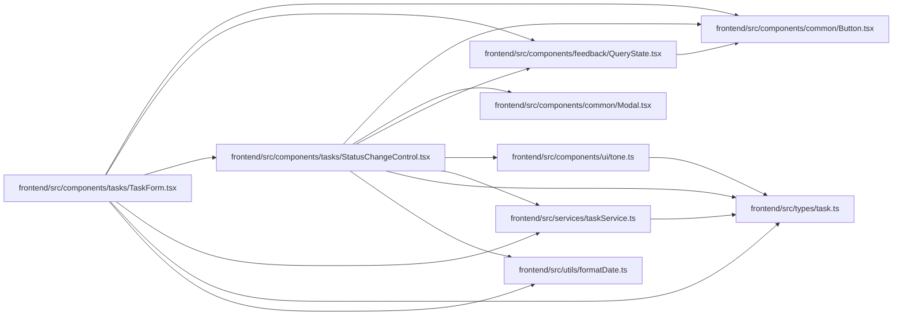

# StatusChangeControl Module

**Path:** `frontend/src/components/tasks/StatusChangeControl.tsx`

## Description

_Auto-generated from `frontend/src/components/tasks/StatusChangeControl.tsx`._

## Imports

| Source | Symbols |
|--------|---------|
| `../../services/taskService` | `taskService` |
| `../../types/task` | `Task`, `TaskStatus`, `CascadeUpdateInfo` |
| `../../utils/formatDate` | `formatDate` |
| `../common/Button` | `Button` |
| `../common/Modal` | `Modal` |
| `../feedback/QueryState` | `QueryErrorState` |
| `../ui/tone` | `pillToneClassName`, `STATUS_TONE` |
| `@tanstack/react-query` | `useMutation`, `useQueryClient` |
| `lucide-react` | `ArrowRight`, `AlertTriangle`, `Check` |
| `react` | `useState` |
| `react-i18next` | `useTranslation` |

## Module Signals

| Signal | Values |
|--------|--------|
| Exports | `StatusChangeControl` |
| Constants | `VALID_TRANSITIONS` |

## Local dependency map

<!-- Auto-generated local dependency summary. Do not edit by hand. -->

### Internal neighbors

| Direction | Module |
|---|---|
| Inbound | [TaskForm](../modules/TaskForm.md) |
| Outbound | [Button](../modules/Button.md) |
| Outbound | [Modal](../modules/Modal.md) |
| Outbound | [QueryState](../modules/QueryState.md) |
| Outbound | [tone](../modules/tone.md) |
| Outbound | [taskService](../modules/taskService.md) |
| Outbound | [types_task](../modules/types_task.md) |
| Outbound | [formatDate](../modules/formatDate.md) |

### External packages

| Language | Used packages | Undeclared packages |
|---|---:|---:|
| typescript | 4 | 0 |

## Classes

| Class | Kind | Line | Bases / Target | Description |
|-------|------|------|----------------|-------------|
| [StatusChangeControlProps](../entities/StatusChangeControlProps.md) | Class | 13 | — | — |

## Functions

| Function | Signature | Decorators | Description |
|----------|-----------|------------|-------------|
| `StatusChangeControl` | `({ task, iterationId, onStatusChanged }: StatusChangeControlProps)` | — | — |
