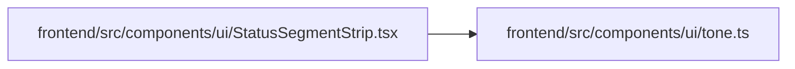

# StatusSegmentStrip Module

**Path:** `frontend/src/components/ui/StatusSegmentStrip.tsx`

## Description

_Auto-generated from `frontend/src/components/ui/StatusSegmentStrip.tsx`._

## Imports

| Source | Symbols |
|--------|---------|
| `./tone` | `PillTone`, `toneVar` |
| `clsx` | `clsx` |
| `react` | `ReactNode` |

## Module Signals

| Signal | Values |
|--------|--------|
| Exports | `StatusSegment`, `StatusSegmentStrip` |

## Local dependency map

<!-- Auto-generated local dependency summary. Do not edit by hand. -->

### Internal neighbors

| Direction | Module |
|---|---|
| Outbound | [tone](../modules/tone.md) |

### External packages

| Language | Used packages | Undeclared packages |
|---|---:|---:|
| typescript | 2 | 0 |

## Classes

| Class | Kind | Line | Bases / Target | Description |
|-------|------|------|----------------|-------------|
| [StatusSegment](../entities/StatusSegment.md) | Type alias | 6 | — | — |

## Functions

| Function | Signature | Decorators | Description |
|----------|-----------|------------|-------------|
| `StatusSegmentStrip` | `({     segments,     columnsClassName = 'grid-cols-2 md:grid-cols-4',     className, }: {     segments: StatusSegment[];     columnsClassName?: string;     className?: string; })` | — | — |
