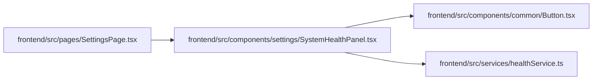

# SystemHealthPanel Module

**Path:** `frontend/src/components/settings/SystemHealthPanel.tsx`

## Description

_Auto-generated from `frontend/src/components/settings/SystemHealthPanel.tsx`._

## Imports

| Source | Symbols |
|--------|---------|
| `../../services/healthService` | `healthService` |
| `../common/Button` | `Button` |
| `@tanstack/react-query` | `useQuery` |
| `lucide-react` | `AlertTriangle`, `CheckCircle2`, `CircleHelp`, `RefreshCw` |
| `react-i18next` | `useTranslation` |

## Module Signals

| Signal | Values |
|--------|--------|
| Exports | `SystemHealthPanel` |
| Constants | `stateClasses`, `stateIcons` |

## Local dependency map

<!-- Auto-generated local dependency summary. Do not edit by hand. -->

### Internal neighbors

| Direction | Module |
|---|---|
| Inbound | [SettingsPage](../modules/SettingsPage.md) |
| Outbound | [Button](../modules/Button.md) |
| Outbound | [healthService](../modules/healthService.md) |

### External packages

| Language | Used packages | Undeclared packages |
|---|---:|---:|
| typescript | 3 | 0 |

## Classes

| Class | Kind | Line | Bases / Target | Description |
|-------|------|------|----------------|-------------|
| [VisibleHealthState](../entities/VisibleHealthState.md) | Type alias | 7 | — | — |

## Functions

| Function | Signature | Decorators | Description |
|----------|-----------|------------|-------------|
| `SystemHealthPanel` | `()` | — | — |
