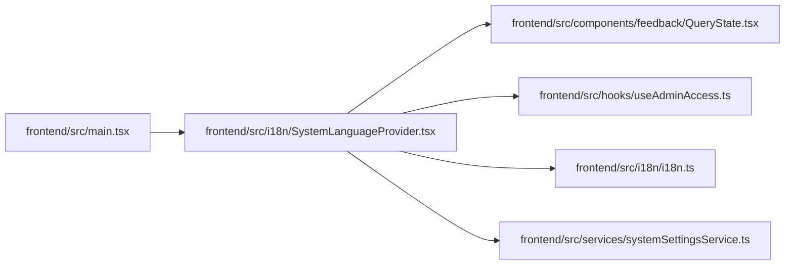

# SystemLanguageProvider Module

**Path:** `frontend/src/i18n/SystemLanguageProvider.tsx`

## Description

_Auto-generated from `frontend/src/i18n/SystemLanguageProvider.tsx`._

## Imports

| Source | Symbols |
|--------|---------|
| `../components/feedback/QueryState` | `QueryErrorState`, `QueryLoadingState` |
| `../hooks/useAdminAccess` | `useAdminAccess` |
| `../services/systemSettingsService` | `systemSettingsService` |
| `./i18n` | `changeAppLanguage` |
| `@tanstack/react-query` | `useQuery` |
| `react` | `ReactNode`, `useEffect` |
| `react-i18next` | `useTranslation` |

## Module Signals

| Signal | Values |
|--------|--------|
| Exports | `SystemLanguageProvider` |

## Local dependency map

<!-- Auto-generated local dependency summary. Do not edit by hand. -->

### Internal neighbors

| Direction | Module |
|---|---|
| Inbound | [src_main](../modules/src_main.md) |
| Outbound | [QueryState](../modules/QueryState.md) |
| Outbound | [useAdminAccess](../modules/useAdminAccess.md) |
| Outbound | [i18n](../modules/i18n.md) |
| Outbound | [systemSettingsService](../modules/systemSettingsService.md) |

### External packages

| Language | Used packages | Undeclared packages |
|---|---:|---:|
| typescript | 3 | 0 |

## Classes

| Class | Kind | Line | Bases / Target | Description |
|-------|------|------|----------------|-------------|
| [SystemLanguageProviderProps](../entities/SystemLanguageProviderProps.md) | Class | 9 | — | — |

## Functions

| Function | Signature | Decorators | Description |
|----------|-----------|------------|-------------|
| `SystemLanguageProvider` | `({ children }: SystemLanguageProviderProps)` | — | — |
