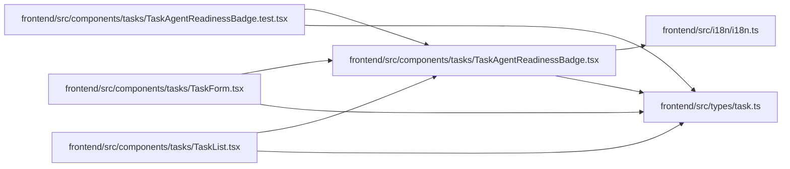

# TaskAgentReadinessBadge Module

**Path:** `frontend/src/components/tasks/TaskAgentReadinessBadge.tsx`

## Description

_Auto-generated from `frontend/src/components/tasks/TaskAgentReadinessBadge.tsx`._

## Imports

| Source | Symbols |
|--------|---------|
| `../../i18n/i18n` | `i18n` |
| `../../types/task` | `TaskAgentReadiness` |
| `clsx` | `clsx` |
| `lucide-react` | `AlertTriangle`, `Bot`, `CheckCircle2`, `XCircle` |
| `react` | `useState`, `useRef`, `useEffect`, `useCallback`, `useId` |
| `react-dom` | `createPortal` |
| `react-router-dom` | `useLocation` |

## Module Signals

| Signal | Values |
|--------|--------|
| Exports | `TaskAgentReadinessBadge` |
| Constants | `t` |
| Module calls | `t = bind` |

## Local dependency map

<!-- Auto-generated local dependency summary. Do not edit by hand. -->

### Internal neighbors

| Direction | Module |
|---|---|
| Inbound | [TaskAgentReadinessBadge.test](../modules/TaskAgentReadinessBadge.test.md) |
| Inbound | [TaskForm](../modules/TaskForm.md) |
| Inbound | [TaskList](../modules/TaskList.md) |
| Outbound | [i18n](../modules/i18n.md) |
| Outbound | [types_task](../modules/types_task.md) |

### External packages

| Language | Used packages | Undeclared packages |
|---|---:|---:|
| typescript | 5 | 0 |

## Classes

| Class | Kind | Line | Bases / Target | Description |
|-------|------|------|----------------|-------------|
| [TaskAgentReadinessBadgeProps](../entities/TaskAgentReadinessBadgeProps.md) | Class | 11 | — | — |

## Functions

| Function | Signature | Decorators | Description |
|----------|-----------|------------|-------------|
| `TaskAgentReadinessBadge` | `({ readiness, mode = 'compact' }: TaskAgentReadinessBadgeProps)` | — | — |
