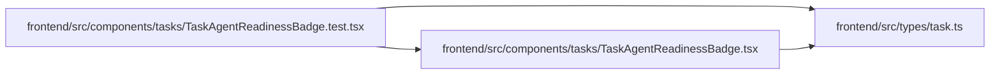

# TaskAgentReadinessBadge.test Module

**Path:** `frontend/src/components/tasks/TaskAgentReadinessBadge.test.tsx`

## Description

_Auto-generated from `frontend/src/components/tasks/TaskAgentReadinessBadge.test.tsx`._

## Imports

| Source | Symbols |
|--------|---------|
| `../../types/task` | `TaskAgentReadiness` |
| `./TaskAgentReadinessBadge` | `TaskAgentReadinessBadge` |
| `@testing-library/react` | `render`, `screen` |
| `@testing-library/user-event` | `userEvent` |
| `react-router-dom` | `MemoryRouter` |
| `vitest` | `describe`, `expect`, `it` |

## Module Signals

| Signal | Values |
|--------|--------|
| Constants | `readiness` |
| Module calls | `describe` |

## Local dependency map

<!-- Auto-generated local dependency summary. Do not edit by hand. -->

### Internal neighbors

| Direction | Module |
|---|---|
| Outbound | [TaskAgentReadinessBadge](../modules/TaskAgentReadinessBadge.md) |
| Outbound | [types_task](../modules/types_task.md) |

### External packages

| Language | Used packages | Undeclared packages |
|---|---:|---:|
| typescript | 4 | 0 |
